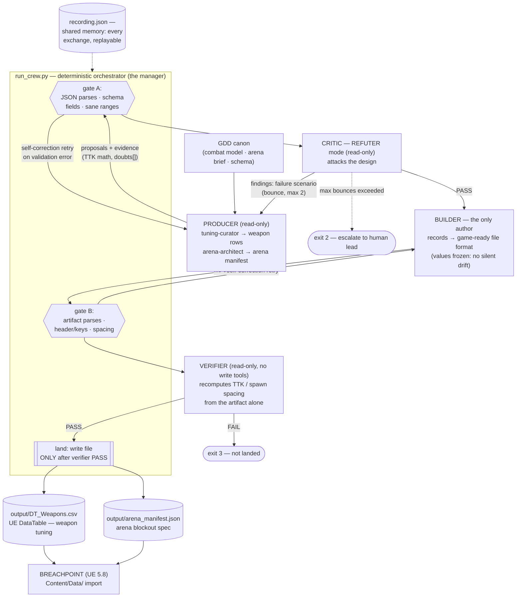

# Assignment #3 — Build an Agent Crew

**Course:** Multi-Agent AI for Game Development · **Student:** Juan Diego Lugo
**Game:** **BREACHPOINT** — a Halo-inspired 4v4 arena FPS (UE 5.8, pure C++, Gameplay
Ability System, Steam listen server). Recharging shields over finite health, a
two-weapon carry, one contested Rocket Launcher on a 90 s timer, and a Grappleshot.

## What this crew produces, and why the game needs it

BREACHPOINT's architecture has a hard law: **data is not code**. Every gameplay
number lives in `Content/Data/*.csv` DataTables; every arena is built from a
manifest before anyone touches a `.umap`. This crew is the production pipeline
that authors that data:

| Artifact | What the game does with it |
|---|---|
| `output/DT_Weapons.csv` | Imported as the UE DataTable behind every weapon — damage, RPM, mags, reload, headshot multiplier, soft asset paths, GameplayCue tags. The sandbox's tuning source of truth. |
| `output/arena_manifest.json` | The spec a level builder executes into the vertical-slice arena blockout — bounds, 8 scored spawn points (farthest-from-combat respawns), named callout landmarks, cover, the contested rocket pad. |
| `output/open_risks_*.json` | Findings the critic raised and judged non-blocking, carried forward so the human lead inherits them instead of losing them. |

These aren't demo artifacts invented for the assignment — they are the actual
first-pass data for the capstone's vertical slice, generated from the GDD's canon
combat model (shields 100 @ 60/s after 2.5 s, health 100 no-regen, 35 m sightline
cap, 0.4 s weapon swap).

## The four agents (each one load-bearing — remove any and the pipeline breaks)

The agent definitions are **the project's real crew files** in
`crew/.claude/agents/` — the same definitions used for production, loaded
directly, not copied. (In the zip distribution they're bundled under `./agents/`.)

| Agent | Role | Input → Output | Remove it and… |
|---|---|---|---|
| **tuning-curator** / **arena-architect** | The only *producer* (read-only). | Design brief + schema → structured proposals with evidence (every damage/RPM row states its implied TTK vs 200 EHP; every spawn carries scoring hints). | …nothing is proposed at all. |
| **critic** (REFUTER mode) | Attacks the *design*. | Proposals → PASS, or findings where every finding is a concrete failure scenario ("input → wrong outcome in a live 4v4"). Findings bounce back to the producer (max 2 rounds, then escalate to the human lead). | …unvalidated balance lands in the game. |
| **builder** | The only *author* of the artifact. | Validated records → the exact game-ready file (UE DataTable CSV / manifest JSON), forbidden from changing values (silent drift is the bug class this pipeline kills). | …nothing reaches game-ready format. |
| **verifier** | Proves the *artifact* (read-only, no write tools by capability). | Final file → independent recomputation of the math (TTK from the row values alone, pairwise spawn distances from the coordinates) + schema/importability audit. PASS required before the file is written to disk. | …"it works" is an unproven claim. |

The critic and the verifier answer **different questions**: the critic argues
whether the numbers are *good* (design), the verifier proves the file is
*correct* (artifact). And because the verifier cannot write, it structurally
cannot patch a failing check into a pass — a stronger separation than a manager
validating its own crew's work.

**Only `high`-severity findings block a landing.** Medium and low are recorded
in `output/open_risks_*.json` and carried forward. Without that split a reviewer
that always finds *something* never lets anything ship — the first version of
this crew deadlocked exactly that way.

### What the crew actually caught (from the committed run)

Not hypotheticals — these are findings from `recording.json`:

- **Rocket one-shot exploit.** The curator's first pass gave the Rocket
  `HeadshotMult=2.0`. The critic computed 120 × 2 = 240 damage against 200 EHP —
  a guaranteed one-shot kill on a full-shield target, destroying the two-shot
  power-weapon fantasy. Fixed to 1.0 before landing.
- **The AR headshot bug.** An AR at `HeadshotMult=2.0` and 600 RPM gave an
  accurate player a faster kill than the Magnum — inverting the sandbox, where
  the AR strips and the Magnum finishes. The crew converged on `1.0`: headshot
  bonuses belong to precision weapons. That is the correct Halo answer, reached
  by the pipeline rather than handed to it.
- **A schema defect the verifier found.** `FireMode` originally held
  `{Automatic, SemiAuto}` while also being the field meant to distinguish
  hitscan from projectile — so the "ProjectileSpeed is 0 for hitscan" invariant
  was *unverifiable at import*. The verifier failed the artifact and named the
  gap. The schema was split into `FireMode` + `DamageDelivery`, and the
  invariant is now enforced deterministically in `run_crew.py`.
- **Deterministic gates firing.** Gate A rejected an arena manifest whose
  spawns sat 7.8 m apart (below the 8 m anti-spawn-camp floor) and the architect
  self-corrected; malformed JSON from the critic triggered the one-retry
  self-correction bridge.

## Architecture



**Data flow:** GDD canon → producer proposals (with evidence) → deterministic
gate → adversarial review (bounce loop) → builder formatting → deterministic
gate → verifier proof → landed artifact → game import. Every agent exchange is
recorded to `recording.json` (the crew's shared memory — finished work is kept
as compact records, not accumulated transcripts).

## Running it

**Replay (no dependencies at all — Python 3 stdlib, no API key, no install):**

```bash
python3 run_crew.py
```

Re-drives the recorded live exchanges through the *same* pipeline code — all
gates, the bounce logic, and validation actually execute; only the LLM calls
are served from `recording.json`. This is so the crew demonstrably runs
end-to-end on any machine.

**Live (calls Claude for real, re-records):**

```bash
python3 run_crew.py --live            # uses ANTHROPIC_API_KEY + `pip install anthropic`,
                                      # or falls back to the `claude` CLI on PATH
python3 run_crew.py --live --job weapons   # one job only
```

`output/run_log.txt` holds the transcript of the committed run, including the
critic's findings and the verifier's arithmetic.

## Why raw orchestration instead of CrewAI

The assignment allows "CrewAI **or raw orchestration code**", and this crew is
deliberately raw, for the reasons Class 04 itself flagged: CrewAI hides context
tracking, rate limiting, and output parsing — exactly the places pipelines fail.
Here the manager is ~500 lines of deterministic, debuggable Python; the
hierarchical pattern (decompose → assign specialists → validate) is implemented
as explicit gates instead of a Manager Agent's judgment; and the error-handling
bridge (validate before accepting, feed the exact error back for one
self-correction) is visible code, not framework magic. One further deviation
from the class pattern, on purpose: validation is *not* done by the manager or
the producers — it's split between an adversarial critic and a write-disabled
verifier, so no agent ever grades its own work.

## Files

```
run_crew.py        the orchestrator + 4-agent pipeline (one file, stdlib only)
recording.json     the committed live run — 18 agent exchanges, prompts included
output/
  DT_Weapons.csv          game-ready weapon tuning table   ← the deliverable
  arena_manifest.json     game-ready arena blockout spec   ← the deliverable
  open_risks_weapons.json  non-blocking findings, carried to the lead
  open_risks_arena.json    non-blocking findings, carried to the lead
  run_log.txt             transcript of the committed run
README.md          this file
```

Everything in `output/` was produced by the crew — nothing there was written
by hand.
