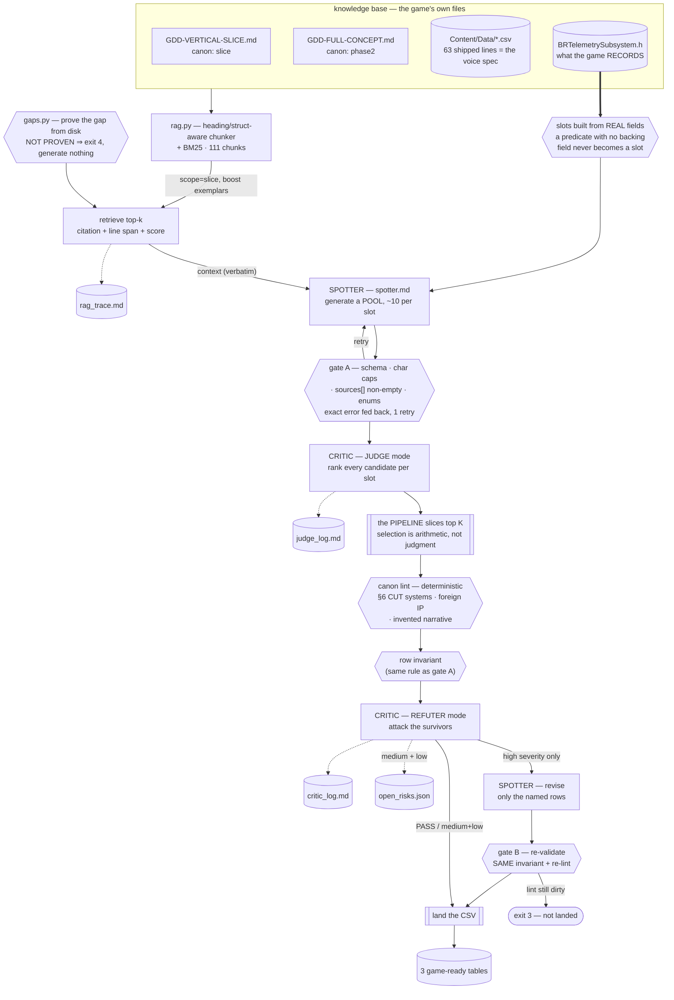

# Assignment #4 — Dynamic Content Pipeline

**Course:** Multi-Agent AI for Game Development · **Student:** Juan Diego Lugo
**Game:** **BREACHPOINT** — a Halo-inspired 4v4 arena FPS (UE 5.8, pure native C++,
Gameplay Ability System, Steam listen server). Shields over finite health, a two-weapon
carry, one contested Rocket Launcher on a 90 s timer, and a Grappleshot.

A RAG pipeline that reads BREACHPOINT's own design document, shipped data tables **and
shipped code**, generates a pool of candidates, ranks them, and only then lets an
adversarial critic try to break the survivors.

```bash
python3 run_pipeline.py          # replay the committed run — stdlib only, no API key
```

It drives the project's **real crew** — `curators/spotter.md` and `critic.md`, loaded from
`breachpoint/.claude/agents/`, not copied — because the crew already contains the authored
owner of this exact job.

---

## 1. The knowledge base is the game's own material

No placeholder lore, and no copy of the GDD that could quietly drift from it. `rag.py`
indexes the capstone's live files, in place, by repo-relative path:

| Source | Chunks | Canon | Why it is in the KB |
|---|---:|---|---|
| `BREACHPOINT-GDD-VERTICAL-SLICE.md` | 37 | `slice` | The document the game is built from |
| `Content/Data/DT_SpotterLines.csv` | 3 | `slice` | 63 shipped announcer lines — **the authored voice itself**, not a description of it |
| `Content/Data/DT_Medals.csv` | 1 | `slice` | The 11 medals and the trigger each fires on |
| `Content/Data/DT_Weapons.csv` | 1 | `slice` | The three-weapon sandbox with real tuning |
| `Content/Data/DT_BotTuning.csv` | 1 | `slice` | The Recruit/Marine/Veteran profiles |
| `Content/Data/DT_MatchRules.csv` | 1 | `slice` | 25 kills / 8:00 / sudden death |
| `Content/Data/arena_manifest.json` | 21 | `slice` | The arena and its named callouts |
| **`Source/…/Telemetry/BRTelemetrySubsystem.h`** | 16 | `slice` | **The telemetry the game actually records** — see §6 |
| `BREACHPOINT-GDD-FULL-CONCEPT.md` | 30 | `phase2` | The Phase-2 game — indexed but tagged, because it is the trap (§9) |

**111 chunks, 9 sources, 81 slice / 30 phase2.**

Three decisions carry the retrieval quality:

**Chunks are headed sections, not fixed windows.** A GDD is already structured; `### 2.7
Information Without Radar` is a complete unit, and a 512-character window would sever "the
slice cuts it" from the heading that makes it findable. Headers chunk per `struct`, so a
field list stays intact. Every chunk keeps its heading trail, source and line span, so
every citation in `output/rag_trace.md` can be opened.

**Chunks are tagged `slice` or `phase2`.** BREACHPOINT has two GDDs describing the same
game at two scopes, and the Phase-2 one documents systems the slice explicitly cuts. Both
are true documents, which is what makes an untagged KB dangerous. §9 shows it failing.

**A design document is not a schema.** Adding the C++ header was not tidiness — it was the
fix for the worst defect this pipeline produced. §6.

> BM25, implemented in `rag.py`, not embeddings. `CREW_PLAYBOOK.md` §14 reached the same
> conclusion independently: *"No vector store: at this project's scale the corpus fits in
> context, and a folder of version-controlled docs beats a database you have to keep in
> sync."* At 111 chunks recall is not the constraint, and the queries are full of rare
> exact tokens lexical search is *better* at — `Kill.Rocket.Multi`, `SelfInflictedDeaths`,
> `push_threshold`.

---

## 2. The agents are the project's, not the assignment's

Assignment #3 loaded the crew's real definitions rather than copying them, on the grounds
that a copy is a fork that drifts. This does the same, and it matters more here:
`CREW_MAP.md` already routes *"Flavor text the game ships (`DT_SpotterLines`, medals)"* to
**spotter — available now**.

Reading `spotter.md` means inheriting constraints no generic "write announcer lines"
prompt would produce:

- generate a **POOL** (~10 per slot) — *"one option is not a choice"*
- hard caps: **48 characters** for an event line, **140** for a coach line
- a line may only name a place the arena manifest named
- **no lore, no fiction, no characters** — inventing narrative is a finding
- fallback lines must stand alone — no live score, no player name
- **coach lines are M4-gated**: without telemetry they are *"invented advice"*

`crew.py` **parses the character caps out of `spotter.md`** rather than hard-coding them,
and exits if the parse fails. A gate that guesses its own threshold is not a gate — and it
means editing `spotter.md` changes this pipeline's gates.

---

## 3. The three gaps, proven from the repo before anything is generated

"Content my game needs" is a claim, and claims here carry evidence (`CLAUDE.md` law 6). So
the pipeline opens with `gaps.py`, which runs checks that pass or fail against real files:

```
$ python3 run_pipeline.py --gaps
  PROVEN  announcer_coverage: Four of eleven medals award in silence
  PROVEN  coach_fallback:     The offline coach line has no canned table to fall back to
  PROVEN  bot_callsigns:      Bots fill up to 7 of 8 slots and none of them has a name
  PROVEN  arena_callouts:     Six of seven named arena landmarks are never spoken  (not filled)
```

| # | The gap | The GDD's promise | The proof (machine-checked) |
|---|---|---|---|
| **1** | Four of eleven medals award **in total silence** | §2.9: "killfeed + medals (Double Kill, Killing Spree, Grapple Kill, **Rocket multi-kill**) — canned, instant, deterministic" | Joining `DT_Medals.TriggerId` → `DT_SpotterLines.TriggerId` leaves **4 orphans**: Blast Radius, Breach, Last Word, Spree Ender |
| **2** | The Spotter's **offline fallback table does not exist** | §3.3: "canned-line DataTable fallback shipped in the build … **No connectivity ⇒ the game is identical minus flavor**" | No `*coach*.csv`; **0 hits** for `coach` across all `.cpp/.h`; of 6 match-end rows, **0** reference a telemetry stat |
| **3** | **Bots have no names**, and bots are most of the killfeed | §1.3: "Solo play is Team Slayer with **seven bots**" | `BRHUDDirector.cpp:276,278` render `GetPlayerName()`; **0** sites set a bot name; no callsign table |
| **4** | Six of seven arena landmarks are **never spoken** | §2.7: without radar, "footstep and weapon audio are the information system" | Only *The Core* appears in any line. **Proven and deliberately NOT filled** — no zone trigger exists to fire a per-landmark line, so the content would be ahead of its system |

The prover is a gate, not a preamble: if a gap stops being provable the pipeline exits `4`
rather than generate into a filled gap. Gap 4 shows the converse — a proven gap the
pipeline **declines** to fill, with the reason recorded.

Full output: **[`output/gap_report.md`](output/gap_report.md)**.

---

## 4. What it generated

| Output | Rows | What the game does with it |
|---|---:|---|
| **[`DT_SpotterLines_Additions.csv`](output/DT_SpotterLines_Additions.csv)** | 12 | Appends to the shipped table — 3 announcer variants for each silent medal |
| **[`DT_CoachLines.csv`](output/DT_CoachLines.csv)** | 12 | The canned match-end coach table, keyed to real telemetry, 2 per predicate |
| **[`DT_BotCallsigns.csv`](output/DT_BotCallsigns.csv)** | 15 | Killfeed names, 5 per tuning profile |

**118 candidates were generated to land these 39 rows.** Nothing in `output/` was written
by hand.

---

## 5. Architecture



**The pool stage is the project's own doctrine, not an invention.** `CREW_PLAYBOOK.md` §13:

> Divergent jobs add ONE stage to the standard pipeline — **generate → score → select** —
> before the critic. The scorer is the critic in JUDGE mode ranking candidates; the REFUTER
> pass still runs on the survivors.

That is Class 05's *"generate 10, keep 3"*, and the playbook is blunter about why:
*"Restraint is failure — one option is not a choice."* **The pipeline, not the model,
performs the selection** — it slices the top K from the judge's ranking, so selection is
arithmetic and cannot drift.

**Two reviewers, on purpose.** The **canon lint** is deterministic Python that greps for
systems §6 lists as cut, another game's vocabulary, and invented narrative. It cannot be
talked out of a finding, and in the naive run it blocked a line the LLM critic rated only
`medium`. The **critic** argues about meaning, which no regex can.

**Only `high` blocks.** Medium and low go to
[`output/open_risks.json`](output/open_risks.json) rather than evaporating.

---

## 6. The defect that mattered most — and it was mine

The first version of this pipeline shipped a coach table where **nine of ten rows keyed on
telemetry the game does not record**: `fights_lost_below_40_shields`, `accuracy_ar`,
`grapple_kills`, `rocket_holds`.

They came from GDD **Appendix C**, which describes the telemetry BREACHPOINT *intends* to
collect. `BRTelemetrySubsystem.h` records what it *has*: `Kills`, `Deaths`, `Assists`,
`SelfInflictedDeaths`, `FriendlyFireKills`, `TimeInMatchSeconds`. A knowledge base of
design documents **cannot tell those apart** — both read as authoritative statements about
the same system.

`spotter.md` had predicted it exactly:

> **Coach lines — M4 and not before:** … *a coach line without a real predicate behind it
> is invented advice.*

Three structural fixes, not a prompt tweak:

1. The header is **in the knowledge base**, with a per-declaration C++ chunker.
2. Coach **slots are built from the real field set** — a predicate with no backing field
   never becomes a slot, so the model is never offered the chance to invent one.
3. A gate checks every declared field against the parsed `UPROPERTY` names, matching
   **whole names**. The first matcher used a substring test, which passes
   `melee_kills_rear` against `Kills` — that is how nine bad rows survived review.

### Two more defects, both in my code, both found by running it

**The matcher silently deleted half the work.** `snake_to_pascal("SelfInflictedDeaths")`
returns `"Selfinflicteddeaths"` — correct for snake_case input, silently wrong for input
already in PascalCase. Three of six predicates were dropped as "not recorded", the table
landed with 6 rows instead of 12, and **nothing complained**, because a dropped slot just
looks like a smaller table. Fixed by normalising both sides; and dropped slots are now
**logged**, so "the matcher is broken" and "the table is small" cannot look alike.

**The revision gate was weaker than the generation gate.** The critic correctly demanded
every `TelemetryField` be the exact PascalCase `UPROPERTY` name — UE resolves properties by
name and the lookup is case-sensitive, so `deaths` never matches `Deaths` and the row can
never fire. The spotter changed the column and left the `{snake_case}` token in the text,
and **12 of 12 rows landed with the declared field and the substitution token
disagreeing** — a defect introduced *by the correction*, waved through by a post-review
check looser than the pre-review one. Both paths now share one invariant function.

> That last one generalises past this assignment: **a review loop whose post-review check is
> looser than its pre-review check can have the reviewer's own correction introduce the
> defect**, and it looks like success the whole way through.

Verified on the landed table: **0 of 12 mismatches**, down from 12 of 12.

---

## 7. What the critic caught

**7 findings across 3 jobs; 4 rows corrected before landing.** Full log with
pipeline-computed before/after diffs: **[`output/critic_log.md`](output/critic_log.md)**.

### A table-wide logic defect no single row would reveal — `high`

The critic worked out that the `Priority` column encoded **two opposite conventions**:

> C02 (`Deaths>=15`) is a strict subset of C01 (`Deaths>12`), and C01's Priority (1) beats
> C02's Priority (2) … so **C02 never fires for any Deaths value**; a player with 20 deaths
> still gets C01's milder *'Peek less, hold cover more'* line. … No single consistent
> tie-break rule makes all 12 rows reachable: lower-wins kills C02/C04, higher-wins kills
> C05/C07/C09/C11 instead.

This is only visible when several rows compete for one slot — which is what the pool stage
produces. The correction landed, and the pipeline verifies it: **6 of 6 field pairs now
consistent, every row reachable.**

### A factual contradiction with a retrieved chunk — earlier run, `high`

> **`B09`** — *"matches Marine's 0.65 push_threshold"*. Canon cited: `DT_BotTuning.csv:3`
> — `push_threshold=0.95`; **0.65 is `cover_preference`**. The generator read the right row
> and grabbed the wrong column. Corrected before landing.

### Arithmetic the generator asserted and could not support — `medium`, carried

> **`B08`** — *"aim_error_deg=5.0, exact midpoint of Recruit 8.0 and Veteran 3.0"*. The
> midpoint of 8.0 and 3.0 is **5.5**. The shipped value is right; the stated derivation is
> false, *"so any curator trusting this Note's formula will derive wrong numbers next
> time."*

Rated `medium`, so per the project's rule it **landed anyway**, into `open_risks.json`.
That trade-off is deliberate — a reviewer that always finds something lets nothing ship —
and this is it firing in public rather than described in the abstract.

---

## 8. Does it sound like BREACHPOINT?

Measured against the 63 shipped lines, not judged by feel:

| | shipped (63) | **landed (12)** | naive run (12) |
|---|---|---|---|
| Words per line — min/median/max | 1 / 2 / 6 | **2 / 3 / 4** | 3 / 4 / 5 |
| Characters, max (cap 48) | 27 | **26** | 30 |
| Exclamation marks | 0 | **0** | 0 |
| `Kill.*` rows scoped `Audience=Self` | 100% | **100%** | **0%** |

**Verdict: yes.** The announcer additions sit inside the shipped register — clipped,
declarative, no exclamation, every kill-event row scoped `Self` with
`RepeatCooldown_s=20`, matching all 24 shipped `Kill.*` rows. Max length 26 characters
against a 48 cap; the shipped table's own max is 27.

The coach lines land at 104 characters against the 140 cap, 12/12 carrying a telemetry
token that now matches its declared field exactly, and every field name lifted from the
header rather than invented. The callsigns are the strongest fit — `Dulledge`, `Midpace`,
`Honedline` — all ≤ 9 characters against a 12-character budget, spread 5/5/5, and each
`Note` citing a specific value from `DT_BotTuning` rather than a vibe.

**The honest weakness:** the callsign critic flagged that *"13 of the 15 rows invent
generic-shooter nickname tropes."* It rated this `medium`, so it landed. I think it is half
right — `Dulledge` and `Honedline` quote the GDD's own words for those columns
(*"Same StateTree, dulled"* / *"sharpened"*), but `Slowdraw` and `Fastdraw` are a
shooter-naming reflex. If I ran this again I would put the finding in the *judge's* ranking
criteria rather than leaving it to the refuter, so trope-y candidates lose before they win.

---

## 9. The retrieval tweak — measured, not remembered

The first live run used the obvious retriever: both GDDs, no boost. Its artifacts are
committed verbatim under [`output/naive/`](output/naive/) — the trace, the critic log and
the 12 rows it landed — alongside `recording_naive.json`, the raw model exchanges they came
from. That run predates the JUDGE stage, so it is kept as archival evidence rather than
replayed; the retriever half of it is still reproducible against today's index:

```bash
python3 run_pipeline.py --naive --dry-run --job announcer   # naive retrieval, no model
```

**Two failures, both retrieval, not prompting:**

1. **43% of the context was the wrong game.** Three of seven chunks came from the Phase-2
   GDD, describing systems the slice cuts. Nothing in the prompt could distinguish them —
   both files are true documents about BREACHPOINT.
2. **The voice exemplars never reached context at all.** `DT_SpotterLines.csv` — the 63
   lines that *are* the announcer voice — lost on pure BM25 to prose *about* the HUD. The
   generator was told "match the shipped voice" and handed no shipped voice.

The output showed both: `Nice shot.`, `First blood. Breach secured.`, a line 8 words long
against a 6-word ceiling, and **`Audience=All` on all 12 rows** when every shipped `Kill.*`
row is `Self` — a convention it could not follow because it never saw it.

**The tweak, two arguments:**

```python
hits = index.search(job.query, k=job.k,
                    scope="slice",                          # (1) canon scope
                    boost={"DT_SpotterLines.csv": 2.5,      # (2) exemplar boost
                           "DT_Medals.csv": 2.0})
```

**Result:** `DT_SpotterLines.csv:50-64` went from absent to rank 2 (BM25 23.41), all three
Phase-2 chunks dropped out, `Audience` correctness went **0% → 100%**, and mean line length
fell from 4.08 words to 3.08 against a shipped 2.49.

> The lesson I did not expect: **the highest-value chunk in a game content KB is usually a
> data table or a header, and those are exactly what lexical scoring is worst at
> retrieving.** Prose about the announcer is full of the words "announcer" and "voice"; the
> announcer's actual lines contain neither. Scoring alone will not find your style guide
> when your style guide is a CSV, or your schema when your schema is a `.h`.

---

## 10. Honest limits

- **These are CSVs on disk, not imported DataTables.** Nothing has been through UE's
  importer and no line has been heard in a match. Schema validation is text-level, not
  engine-level. Importing them is a separate ticket with a binary-asset lock — which is why
  they are **not** copied into `breachpoint/Content/Data/`.
- **Spotter and critic are the same model**, separated by role and prompt. Assignment #3's
  separation was structural (the verifier had no write tools); this is weaker.
- **Coach lines remain M4-gated in spirit.** They now key only to fields the game records,
  which removes the "invented predicate" half of `spotter.md`'s objection. The **thresholds**
  (`Deaths >= 15`, `TimeInMatchSeconds <= 120`) are still authored without soak data, and
  calibrating them is M4 work.
- **Five medium findings are carried, not applied** — including the `B08` arithmetic above.
- **Cost is real:** $4.18 for the committed run, ~$10.50 across three live runs while the
  two code defects in §6 were found and fixed. The previous single-pass pipeline cost
  $1.16. A pool of 118 candidates is roughly 8× the tokens of generating 39 rows directly;
  the two `high` findings it surfaced would not have been visible without it.

---

## 11. Running it

```bash
python3 run_pipeline.py                    # replay the committed run — stdlib only, no API key
python3 run_pipeline.py --gaps             # prove the four gaps, call nothing
python3 run_pipeline.py --dry-run          # assemble every prompt, call nothing
python3 run_pipeline.py --dry-run --live   # + one tiny round trip per agent/stage
python3 run_pipeline.py --live             # real calls, re-records
python3 run_pipeline.py --live --job coach --model claude-haiku-4-5
python3 crew.py                            # show which agent definitions are loaded
python3 rag.py "telemetry fields the game records"   # query the KB directly
```

**Replay is not a printout.** Retrieval, both gates, the canon lint, the telemetry-field
check, the row invariant, the judge's selection arithmetic, the bounce loop and CSV
assembly all execute for real; only the model responses come from `recording.json`, and the
engine asserts each arrives at the same `agent/stage/job` the pipeline asked for. The three
CSVs are rewritten byte-identically on every replay.

**Committed live run:** `claude-sonnet-5`, 11 calls, 145,942 output tokens, **$4.18**.

## 12. Files

```
run_pipeline.py     orchestrator · engines · 3 jobs · gates · canon lint     ← the pipeline
rag.py              chunker (md/csv/json/C++) + BM25 + canon tagging         ← retrieval
gaps.py             proves four gaps from disk                               ← the gate before generation
crew.py             loads the REAL spotter.md / critic.md, parses their caps ← the crew
recording.json      the committed live run — 11 exchanges, prompts included
recording_naive.json  the pre-tweak run, kept as evidence for §9
make_submission.sh  builds the zip; mirrors the KB + agent definitions, self-tests the replay
TICKET_SUBMIT.md    the submission checklist
output/
  DT_SpotterLines_Additions.csv   12 announcer lines   ← deliverable
  DT_CoachLines.csv               12 coach lines       ← deliverable
  DT_BotCallsigns.csv             15 bot callsigns     ← deliverable
  rag_trace.md      query · retrieved chunk · output, side by side, all 3 jobs
  judge_log.md      the full pool, the ranking, and what was left behind
  critic_log.md     every finding, with computed before/after diffs
  gap_report.md     the four gaps and the checks that prove them
  open_risks.json   the non-blocking findings, carried to the human lead
  run_log.txt       transcript of the committed run
  naive/            the pre-tweak artifacts, for §9's comparison
README.md           this file
```
