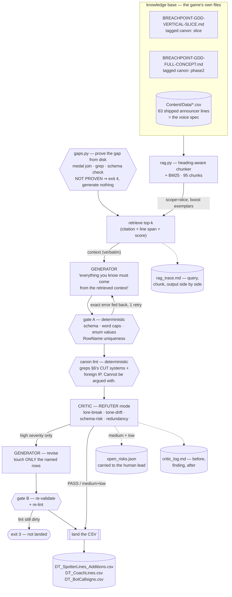

# Assignment #4 — Dynamic Content Pipeline

**Course:** Multi-Agent AI for Game Development · **Student:** Juan Diego Lugo
**Game:** **BREACHPOINT** — a Halo-inspired 4v4 arena FPS (UE 5.8, pure native C++,
Gameplay Ability System, Steam listen server). Shields over finite health, a two-weapon
carry, one contested Rocket Launcher on a 90 s timer, and a Grappleshot.

A RAG pipeline that reads BREACHPOINT's own design document and shipped data tables, then
writes three pieces of content the game is provably missing — and refuses to land any of
it until an adversarial critic has argued against it.

```bash
python3 run_pipeline.py          # replay the committed run — stdlib only, no API key
```

---

## 1. The knowledge base is the game's real GDD

No placeholder lore, and no copy of the GDD that could quietly drift from it. `rag.py`
indexes the capstone's live files, in place, by repo-relative path:

| Source | Chunks | Canon | Why it is in the KB |
|---|---:|---|---|
| `breachpoint/BREACHPOINT-GDD-VERTICAL-SLICE.md` | 37 | `slice` | The document the game is being built from — the shipped design |
| `breachpoint/Content/Data/DT_SpotterLines.csv` | 3 | `slice` | 63 shipped announcer lines — **the authored voice itself**, not a description of it |
| `breachpoint/Content/Data/DT_Medals.csv` | 1 | `slice` | The 11 medals and the trigger each one fires on |
| `breachpoint/Content/Data/DT_Weapons.csv` | 1 | `slice` | The three-weapon sandbox, with real tuning |
| `breachpoint/Content/Data/DT_BotTuning.csv` | 1 | `slice` | The Recruit/Marine/Veteran profiles |
| `breachpoint/Content/Data/DT_MatchRules.csv` | 1 | `slice` | 25 kills / 8:00 / sudden death |
| `breachpoint/Content/Data/arena_manifest.json` | 21 | `slice` | The arena and its callout landmarks |
| `breachpoint/BREACHPOINT-GDD-FULL-CONCEPT.md` | 30 | `phase2` | The Phase-2 game — **indexed but tagged, because it is the trap** (§9) |

**95 chunks, 8 sources, 65 slice / 30 phase2.**

Two decisions carry most of the retrieval quality:

**Chunks are headed sections, not fixed windows.** A GDD is already structured. `### 2.7
Information Without Radar` is a semantically complete unit, and a 512-character window
would sever the sentence "the slice cuts it" from the heading that makes it findable.
Every chunk keeps its heading trail, source file and line span, so every citation in
`output/rag_trace.md` reads `file:line-line` and can be opened.

**Chunks are tagged `slice` or `phase2`.** BREACHPOINT has two GDDs describing the same
game at two scopes, and the Phase-2 one documents systems the slice explicitly cuts. Both
are true documents, which is exactly what makes an untagged KB dangerous: retrieval will
happily hand back a cut system as canon. §9 shows it doing precisely that.

> BM25, implemented in `rag.py`, not embeddings. At ~95 chunks recall is not the
> constraint, the queries are full of rare exact tokens that lexical search is *better*
> at (`Kill.Rocket.Multi`, `Grappleshot`, `push_threshold`), and it adds no dependency and
> no network call. At 10,000 chunks the answer flips; here an embedding index would be a
> worse retriever with more moving parts.

---

## 2. The three gaps, proven from the repo before anything is generated

"Content my game needs" is a claim, and claims in this project carry evidence
(`CLAUDE.md` law 6). So the pipeline opens with `gaps.py`, which does not describe what is
missing — it runs checks against the shipped files that pass or fail:

```
$ python3 run_pipeline.py --gaps
  PROVEN     announcer_coverage: Four of eleven medals award in silence
  PROVEN     coach_fallback:     The offline coach line has no canned table to fall back to
  PROVEN     bot_callsigns:      Bots fill up to 7 of 8 slots and none of them has a name
```

| # | The gap | The GDD's promise | The proof (machine-checked) |
|---|---|---|---|
| **1** | Four of eleven medals award **in total silence** | §2.9: "killfeed + medals (Double Kill, Killing Spree, Grapple Kill, **Rocket multi-kill**) — canned, instant, deterministic" | Joining `DT_Medals.TriggerId` → `DT_SpotterLines.TriggerId` leaves **4 orphans**: Blast Radius (`Kill.Rocket.Multi`), Breach (`Kill.First`), Last Word (`Match.SuddenDeath.Win`), Spree Ender (`Kill.SpreeEnder`) |
| **2** | The Spotter's **offline fallback table does not exist** | §3.3: "canned-line DataTable fallback shipped in the build … **No connectivity ⇒ the game is identical minus flavor**" | No `*coach*.csv` in `Content/Data`; **0 hits** for `coach` across all `.cpp/.h`; of 6 match-end rows in `DT_SpotterLines`, **0** reference a telemetry stat, which §3.3 requires of a coach line |
| **3** | **Bots have no names**, and bots are most of the killfeed | §1.3: "Solo play is Team Slayer with **seven bots**" | `BRHUDDirector.cpp:280,282` render `GetPlayerName()`; **0** sites anywhere set a bot name; no callsign table on disk |

The gap prover is a gate, not a preamble. If a gap ever stops being provable — someone
lands the table — the pipeline exits `4` and refuses to generate, because filling a filled
gap is waste and the honest place to catch that is before the model is called.

Full output: **[`output/gap_report.md`](output/gap_report.md)**.

---

## 3. What it generated

| Output | Rows | What the game does with it |
|---|---:|---|
| **[`output/DT_SpotterLines_Additions.csv`](output/DT_SpotterLines_Additions.csv)** | 12 | Appends to the shipped `DT_SpotterLines` — 3 announcer variants for each of the 4 silent medals, so a player earning one twice doesn't hear the same clip |
| **[`output/DT_CoachLines.csv`](output/DT_CoachLines.csv)** | 10 | The canned match-end coach table. Each row is a telemetry condition + a line with a `{substitution_token}`, so the offline fallback still "references ≥ 1 telemetry stat" as §3.3 demands |
| **[`output/DT_BotCallsigns.csv`](output/DT_BotCallsigns.csv)** | 15 | Killfeed/scoreboard names for bots, spread 5/5/5 across the Recruit, Marine and Veteran tuning profiles |

Every schema field matches a real table in `Content/Data/` or a field name lifted from the
GDD's Appendix C telemetry schema. Nothing in `output/` was written by hand.

---

## 4. Architecture



**Two reviewers, on purpose.** The **canon lint** is deterministic Python that greps for
the systems §6 lists as cut (motion tracker, radar, plasma, vehicles, FFA, flag modes) and
for another game's vocabulary. It cannot be talked out of a finding, and it fired in the
naive run when the LLM critic rated the same line only `medium`. The **critic** argues
about meaning, which no regex can. Neither alone is enough.

**Only `high` blocks.** Medium and low findings are real and go to
[`output/open_risks.json`](output/open_risks.json) rather than evaporating — the same rule
Assignment #3 landed on after a first version that found something every round and let
nothing ship.

---

## 5. RAG, shown rather than claimed

**[`output/rag_trace.md`](output/rag_trace.md)** (772 lines) carries all three jobs: the
exact query, every retrieved chunk *verbatim as the generator received it* with its
citation, canon tag and BM25 score, and the landed rows beneath. One worked example, from
the callsigns job:

**Query** — `scope=slice`, boost `{DT_BotTuning.csv: 2.0}`
```
bots fill every unfilled slot difficulty profiles Recruit Marine Veteran
killfeed scoreboard player name team slayer
```

**Top chunk** — `breachpoint/Content/Data/DT_BotTuning.csv:2-4`, canon `slice`, BM25 **27.02**
```text
DT_BotTuning.csv (existing shipped table)
Name,reaction_ms,...,accuracy_pct,aim_error_deg,switch_margin,...,rocket_contest,push_threshold,cover_preference,...
Recruit,500,20,120,0.25,8.0,0.30,1400,400,0.30,1.00,0.45,35.0,90.0,2.0,600,...
Marine,320,20,80,0.45,5.0,0.20,900,300,0.60,0.95,0.65,35.0,90.0,3.5,350,...
Veteran,220,20,60,0.65,3.0,0.15,600,200,1.00,0.85,0.85,35.0,90.0,5.0,220,...
```

**Output** — retrieved values appear in the generated rows, per row, as reasoning:
```
B05,STANDBY, Recruit, Waits before it acts — pairs with the 500ms reaction floor.
B11,DEADBOLT,Veteran, Locks on and doesn't let go — fits 65% accuracy and the tightest aim_error.
B14,REDLINE, Veteran, Pushed to the fastest setting — pairs with Veteran's 220ms reaction.
```

Every one of those numbers is in the chunk above. `0.65` appears in **no other retrieved
chunk** — it exists only in this table — so B09's citation of it is traceable to this
retrieval and nothing else. (`500`/`220` also appear in the §2.8 bot table at
`…VERTICAL-SLICE.md:195-210`, which was retrieved at rank 2; I am not claiming those two
are uniquely sourced.) That is the retrieval being load-bearing rather than decorative —
and §6 shows what happened on the one row where the generator misread this same table.

---

## 6. What the critic caught

**8 findings across 3 jobs; 3 rows corrected before landing.** Full log with computed
before/after diffs: **[`output/critic_log.md`](output/critic_log.md)**. Three worth naming.

### A factual contradiction with a retrieved chunk — `high`, corrected

The strongest catch in the run, because the critic refuted the generator using the very
chunk both had been given.

| | |
|---|---|
| **Row** | `B09` (callsign WARDEN) |
| **Objected to** | `matches Marine's 0.65 push_threshold, steady not sharp.` |
| **Canon cited** | `DT_BotTuning.csv:3` — `Marine,320,20,80,0.45,5.0,0.20,900,300,0.60,0.95,0.65,…` |
| **Why** | "The note cites 0.65 as Marine's `push_threshold`, but the shipped table has `push_threshold=0.95` for Marine — **0.65 is actually `cover_preference`**, so the row misstates a canonical data value." |
| **Correction landed** | `matches Marine's 0.65 cover_preference, steady not sharp.` |

The generator read the right row and grabbed the wrong column. A human reviewer skims past
that; a critic holding the same chunk counts the commas.

### A collision with an existing shipped row — `high` ×2, corrected

`Kill.SpreeEnder` fires when *you end someone else's* spree. The generator wrote it from
the wrong point of view, and the critic caught that it collided with a line already in the
table:

| Row | Before | Finding | After |
|---|---|---|---|
| `S25a` | `Spree ended.` | reads identically to the player's *own* spree being interrupted — inverts what medal M11 rewards | `Enemy spree ended.` |
| `S25b` | `Killing spree stopped.` | "nearly a negation of **S04b's** `Killing spree.`" — two rows in one table that read as opposites | `Their spree, stopped.` |

Catching S25b required holding both the *generated* rows and the *shipped* table at once.
That is a retrieval result, not a prompt result: `DT_SpotterLines.csv:50-64` was in context.

### Tone drift the deterministic lint caught first — naive run

In the pre-tweak run (§9) the generator wrote `Nice shot.` for a spree-ender. The LLM
critic rated it `medium` — "a direct, chatty compliment to the player, breaking the
third-person telegraphic register." The canon lint rated the same string `high` and
blocked the landing. The regex was right and the model was too generous; this is the
argument for keeping both reviewers.

---

## 7. Does it sound like BREACHPOINT?

Measured against the 63 shipped lines, not judged by feel:

| | shipped (63) | **landed (12)** | naive run (12) |
|---|---|---|---|
| Words per line — min/median/max | 1 / 2 / 6 | **2 / 3 / 4** | 3 / 4 / 5 |
| Mean words | 2.49 | **3.08** | 4.08 |
| Exclamation marks | 0 | **0** | 0 |
| `Kill.*` rows scoped `Audience=Self` | 100% | **100%** | **0%** |

**Verdict: yes, with one reservation.**

The announcer additions sit inside the shipped register — clipped, declarative, no
exclamation, and every kill-event row scoped `Self` and `RepeatCooldown_s=20`, matching how
all 24 shipped `Kill.*` rows are scoped. The landed set runs ~0.6 words longer on average
than the shipped table, which is the honest miss: `Rocket kill. Multiple down.` is a
touch wordier than `Rocket denied.` It is inside the shipped 1–6 range, so it will not
sound foreign, but the shipped table is terser than what I generated.

The coach lines land squarely: 20 words max against the GDD's 30-word cap, 10/10 carrying
a telemetry token, and every field name drawn from Appendix C rather than invented. The
callsigns are the strongest fit — `HOLDFAST`, `DEADBOLT`, `GRIDLOCK` read as squad
callsigns next to a human Steam name, all ≤ 9 characters against a 12-character killfeed
budget, and spread exactly 5/5/5 across the tuning profiles.

**One output is more derivative than I would like.** Coach row `C01` came back as *"You
lost {fights_lost_below_40_shields} fights below 40% shields — break off and let them
recharge"* — which is very nearly §3.3's own worked example. That is retrieval doing its
job loudly, but it means C01 is quotation, not authorship. The other nine rows are novel;
C01 stays because the line is genuinely correct, and it is flagged here rather than
quietly counted as generated content.

---

## 8. Honest limits

The rungs this work has and has not climbed (`CLAUDE.md` law 6 — *compiles ≠ works*):

- **These are CSVs on disk, not imported DataTables.** Nothing here has been through UE's
  importer, and no line has been heard in a match. The schema is validated against the
  shipped tables' columns and value domains; that is a text-level check, not an engine one.
  Importing them is a separate ticket with a binary-asset lock.
- **Generator and critic are the same model.** Assignment #3's separation was structural —
  the verifier had no write tools. Here the separation is only role and prompt, which is
  weaker, and the C02 finding below is the kind of thing a genuinely independent reviewer
  might have caught in the first pass instead of the second.
- **One medium finding is a real defect that shipped to `open_risks.json`.** Coach `C02`
  compares `shield_break_to_kill_conversion` against a 0–1 threshold while the accuracy
  fields in the same table are 0–100, so the line may render "converted 0.42 of those
  breaks." It is carried, not fixed — fixing it is a telemetry-schema decision, not a
  content one.
- **Five medium findings total are carried, not applied**, including two redundancy calls
  (`FALLBACK`/`BACKSTOP`, `IRONCLAD`/`LOCKSTEP` encode near-identical personas).

---

## 9. The retrieval tweak — measured, not remembered

The first live run used the obvious retriever: both GDDs indexed together, no boost. It is
still runnable, and its artifacts are committed under `output/naive/` so the comparison is
reproducible:

```bash
python3 run_pipeline.py --live --naive --job announcer --recording recording_naive.json
```

**Two failures, both caused by retrieval rather than by the prompt:**

1. **43% of the context was the wrong game.** Three of seven chunks came from
   `BREACHPOINT-GDD-FULL-CONCEPT.md` — the Phase-2 document describing systems the slice
   cuts. Nothing in the generator's prompt could distinguish them from shipped canon,
   because both files are true documents about BREACHPOINT.
2. **The voice exemplars never made it into context at all.** `DT_SpotterLines.csv` — the
   63 lines that *are* the announcer voice — lost on pure BM25 to prose *about* the HUD.
   The generator was told "match the shipped voice" and handed no shipped voice.

The output showed both. `Nice shot.` and `First blood. Breach secured.` (stock shooter
slang, flagged by the critic as "not established anywhere in the canon"), a line 8 words
long against a 6-word ceiling that gate A bounced, and **`Audience=All` on all 12 rows**
when every one of the 24 shipped `Kill.*` rows is `Self` — a convention the generator
could not have followed because it never saw it.

**The tweak, two lines in `Index.search`:**

```python
hits = index.search(job.query, k=job.k,
                    scope="slice",                          # (1) canon scope
                    boost={"DT_SpotterLines.csv": 2.5,      # (2) exemplar boost
                           "DT_Medals.csv": 2.0})
```

`scope` filters retrieval to chunks tagged as shipped canon. `boost` multiplies the score
of chunks whose source path matches — the job declaring that the table it is extending
outranks prose about that table.

**Result:** `DT_SpotterLines.csv:50-64` went from absent to rank 2 (BM25 22.54), all three
Phase-2 chunks dropped out, `Audience` correctness went **0% → 100%**, and mean line length
fell from 4.08 words to 3.08 against a shipped 2.49.

The general lesson, and the one I did not expect: **the highest-value chunk in a game
content KB is usually a data table, and it is the chunk plain lexical scoring is worst at
retrieving.** Prose about the announcer is full of the words "announcer" and "voice"; the
announcer's actual lines contain neither. Scoring alone will not find your style guide when
your style guide is a CSV.

---

## 10. Running it

```bash
python3 run_pipeline.py                 # replay the committed run — stdlib only, no API key
python3 run_pipeline.py --gaps          # prove the three gaps, call nothing
python3 run_pipeline.py --dry-run       # assemble every prompt, call nothing
python3 run_pipeline.py --dry-run --live   # + one tiny round trip per agent (auth/model/transport)
python3 run_pipeline.py --live          # real calls, re-records
python3 run_pipeline.py --live --job coach --model claude-haiku-4-5
python3 rag.py "rocket launcher respawn timer"   # query the KB directly
```

**Replay is not a printout.** Retrieval, both gates, the canon lint, the bounce logic,
CSV assembly and the open-risk split all execute for real; only the model responses come
from `recording.json`, and the engine asserts each one arrives at the same
`agent/stage/job` the pipeline asked for. The three CSVs are rewritten byte-identically on
every replay.

**Committed live run:** `claude-sonnet-5`, 8 calls, 37,856 output tokens, **$1.16**.
Per-call usage is recorded in `recording.json` and rolled up at exit — Class 04 lists
context tracking first among the things a framework hides, so here it is a number.

## 11. Files

```
run_pipeline.py     orchestrator, engines, 3 jobs, gates, canon lint   ← the pipeline
rag.py              heading-aware chunker + BM25 + canon tagging       ← retrieval
gaps.py             proves the three gaps from disk                    ← the gate before generation
recording.json      the committed live run — 8 exchanges, prompts included
recording_naive.json  the pre-tweak run, kept as evidence for §9
output/
  DT_SpotterLines_Additions.csv   12 announcer lines    ← deliverable
  DT_CoachLines.csv               10 coach lines        ← deliverable
  DT_BotCallsigns.csv             15 bot callsigns      ← deliverable
  rag_trace.md        query · retrieved chunk · output, side by side, all 3 jobs
  critic_log.md       every finding, with computed before/after diffs
  gap_report.md       the three gaps and the checks that prove them
  open_risks.json     the 5 non-blocking findings, carried to the human lead
  naive/              the pre-tweak artifacts, for §9's comparison
README.md           this file
```
