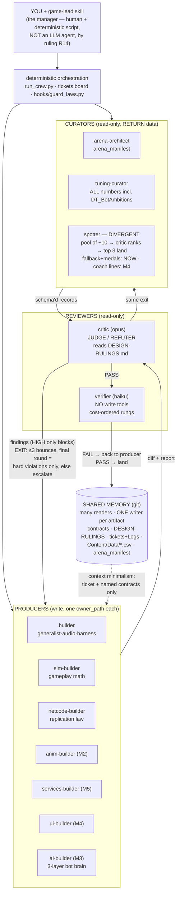
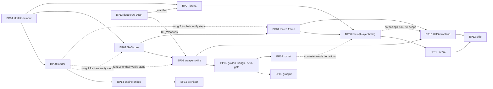

# Crew Map — structure, cycles, and when to call whom

The visual layer of the crew (class doctrine: diagrams reveal bottlenecks and circular
dependencies before they cause failures). Two graphs and one matrix. **Every intentional
cycle prints its exit condition on the edge** — a cycle without one is the deadlock the
first pipeline build actually hit.

## 1. The crew graph — 12 agents, 3 powers, exits printed

## 2. The ticket dependency graph (the board as a DAG — cycle-hunting surface)

> **The `## Kickoff` block in each ticket is AUTHORITATIVE; this diagram is derived from it.**
> Declared 31 Jul 2026 after the two disagreed in four places and the diagram was teaching a
> false order. The Kickoff is the gate a machine actually enforces — the tickets skill verifies
> it and refuses the claim on failure — whereas a diagram is checked by nobody. **If they ever
> diverge again, the ticket wins and this diagram is the bug.**
>
> **Ticket numbers are IDENTIFIERS, not a running order.** BP01 runs before BP00. Renumbering
> is not on the table: 365 references across 44 files, zero functional gain.

**Solid = HARD gate** (named in the target's Kickoff; blocks the claim).
**Dashed = SOFT dependency** (a later *step* needs it; does not block the claim, and the packet
starts and lands most of its work without it).

**What changed and why** (31 Jul 2026 — every edge below was contradicted by the target
ticket's own Kickoff):

| Was | Now | Evidence |
|---|---|---|
| `BP06 → BP07` hard | **removed** — BP07 gated by `BP01` + BP13 manifest | BP07's Kickoff names BP01 DONE and the manifest; its STATUS says *"runs parallel with BP06"* |
| `BP09 → BP08` hard | **soft** | BP08's Kickoff names BP04 and BP07 only |
| `BP00 → BP02/03/04` hard | **soft** | none of those Kickoffs mention BP00; they need it for their *verify* steps (rung 2), not to start |
| `BP08 → BP10` hard | **soft** | BP10's Kickoff names BP03 and BP04 |

**The scheduling consequence, which is the point of fixing this:** **BP07 (the arena) unblocks
the moment BP01 closes** — its manifest landed with BP13 back on 29 Jul. The old `BP06 → BP07`
edge hid it behind the entire golden-triangle chain, so the arena looked like a mid-project
task when it is in fact runnable in parallel with BP02. BP08 needs it, and BP08 is the M4 gate.

No cycles — and keeping it that way is this diagram's job. A new ticket that would create
one (X needs Y, Y needs X) gets split at cut time, not discovered mid-milestone.

### 2b. Execution tiers (derived from the Kickoffs, hard gates only)

Two of these are **harness** tickets, not game features — `BP14` (engine bridge) and `BP15`
(architect) build the machinery the crew runs on. They gate no gameplay ticket and no gameplay
ticket gates them, which is why they hang off the BP00 spine rather than the feature chain.

| Tier | Tickets | Gate |
|---|---|---|
| 0 | **BP01** · BP13 ✅ | nothing |
| 1 | **BP00** | BP01 step 1 landed |
| 2 | **BP02** · **BP07** · BP14 ⚙ | BP01 DONE (BP14 also BP00 DONE) |
| 3 | BP03 · BP04 · BP15 ⚙ | BP02 DONE (BP15: BP14 step 1) |
| 4 | BP05 · BP10 | BP03/BP04 |
| 5 | BP06 · BP09 | BP05 |
| 6 | BP08 | BP04 + BP07 |
| 7 | BP11 | BP08 (M4) |
| 8 | BP12 | BP11 (M5) |

⚙ = harness ticket.

> **BP15 was absent from this diagram entirely** until 31 Jul 2026 — it was cut on the 31st,
> two days after this map was written on the 29th, and nobody added it. Recorded because the
> omission is the more interesting half: **a ticket that exists on the board but not in the
> graph is invisible to exactly the check this diagram is for.** Anyone reasoning about order
> from the picture would never have seen it.
>
> A second trap it exposed, worth naming so it is not repeated: BP15's STATUS says *"steps 1–3
> and 7 run anywhere (no engine)"*. That is a statement about **which machine**, not about
> **what gates it** — the lead misread it as tier 0 on first pass. Its real Kickoff is
> a crew runner replaying from the game repo. That runner has since been removed.
> Portability and dependency are different axes; a ticket can need no engine and still be
> blocked by four others.

Tier 2 is the first tier with genuine parallelism — BP02 and BP07 share no `owner_path` and can
run as two pods (`CREW_PLAYBOOK` §12), subject to **R21**: separate worktrees give disjoint
files, not disjoint build locks. Two builders may write simultaneously; only one may compile.

## 3. Invocation matrix — who wakes when

| Trigger | Invoke | Mode |
|---|---|---|
| Tuning numbers / arena data / bot ambitions | `run_crew.py --job …` | pipeline (runs anywhere) |
| Any code ticket | `/tickets <name>` → game-lead dispatches per ticket's Crew line | terminal build session |
| M1 Foundry (BP00–BP04) | builder · sim-builder · netcode-builder (+critic, verifier always) | terminal |
| M2 Triangle (BP05–BP06) | + **anim-builder wakes** | terminal |
| M3 Playground (BP07–BP09) | + **ai-builder wakes** (brain per BREACHPOINT-AI-BOTS.md) | terminal |
| Flavor text the game ships (`DT_SpotterLines`, medals) | **spotter — fallback half, available now** (its inputs are the GDD, the manifest's callouts, and `DT_Weapons` — no telemetry involved) | pipeline |
| M4 First Match (BP08/BP10) | + **ui-builder wakes** · **spotter's coach half wakes** (telemetry finally exists) · nightly soaks start | terminal + cron |
| M5 Two Boxes (BP11) | + **services-builder wakes** | terminal + 2 machines |
| Any replicated surface, any time | netcode-builder + critic-writes-the-cheat, non-negotiable | — |
| A ruling is questioned | founder/lead edits DESIGN-RULINGS.md — never a review outcome | — |

**Parallel pods (simultaneous builders):** one git worktree per active builder, each claimed
to a different ticket (different owner_paths — the hook enforces non-collision), binaries
locked per law 7, lead session reconciles by pulling the board. Recipe: CREW_PLAYBOOK §12.

**Standing rule:** at any moment you run 4–7 agents, not 12. Dormant ≠ deleted — a dormant
agent costs nothing until its KICKOFF conditions turn true.
