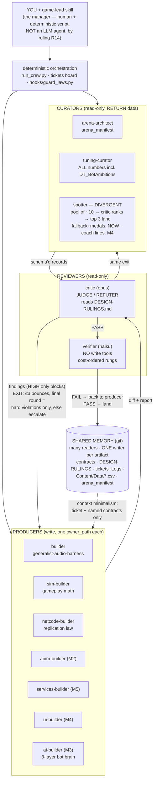
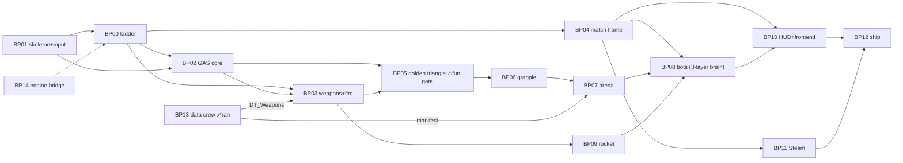

# Crew Map — structure, cycles, and when to call whom

The visual layer of the crew (class doctrine: diagrams reveal bottlenecks and circular
dependencies before they cause failures). Two graphs and one matrix. **Every intentional
cycle prints its exit condition on the edge** — a cycle without one is the deadlock the
first pipeline build actually hit.

## 1. The crew graph — 12 agents, 3 powers, exits printed

## 2. The ticket dependency graph (the board as a DAG — cycle-hunting surface)

No cycles — and keeping it that way is this diagram's job. A new ticket that would create
one (X needs Y, Y needs X) gets split at cut time, not discovered mid-milestone.

## 3. Invocation matrix — who wakes when

| Trigger | Invoke | Mode |
|---|---|---|
| Tuning numbers / arena data / bot ambitions | `run_crew.py --job …` | pipeline (runs anywhere) |
| Any code ticket | `/tickets <name>` → game-lead dispatches per ticket's Crew line | terminal build session |
| M1 Foundry (BP00–BP04) | builder · sim-builder · netcode-builder (+critic, verifier always) | terminal |
| M2 Triangle (BP05–BP06) | + **anim-builder wakes** | terminal |
| M3 Playground (BP07–BP09) | + **ai-builder wakes** (brain per BREACHPOINT-AI-BOTS.md) | terminal |
| Flavor text the game ships (`DT_SpotterLines`, medals) | **spotter — fallback half, available now** (its inputs are the GDD, the manifest's callouts, and `DT_Weapons` — no telemetry involved) | pipeline |
| M4 First Match (BP08/BP10) | + **ui-builder wakes** · **spotter's coach half wakes** (telemetry finally exists) · nightly soaks start | terminal + cron |
| M5 Two Boxes (BP11) | + **services-builder wakes** | terminal + 2 machines |
| Any replicated surface, any time | netcode-builder + critic-writes-the-cheat, non-negotiable | — |
| A ruling is questioned | founder/lead edits DESIGN-RULINGS.md — never a review outcome | — |

**Parallel pods (simultaneous builders):** one git worktree per active builder, each claimed
to a different ticket (different owner_paths — the hook enforces non-collision), binaries
locked per law 7, lead session reconciles by pulling the board. Recipe: CREW_PLAYBOOK §12.

**Standing rule:** at any moment you run 4–7 agents, not 12. Dormant ≠ deleted — a dormant
agent costs nothing until its KICKOFF conditions turn true.
