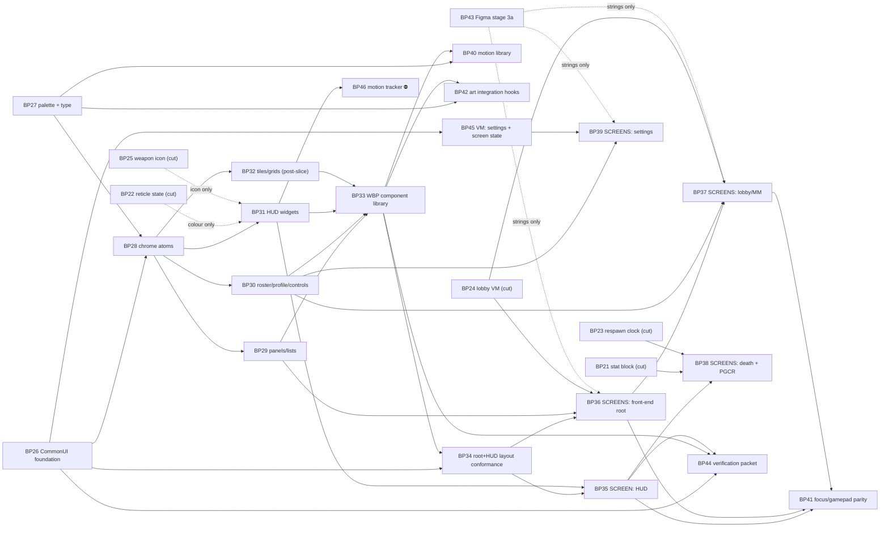

# PROPOSED TICKETS — the UE 5.8 front-end build (BP26–BP46)

> **STATUS: proposal — nothing here is cut.** No file exists in `docs/tickets/` for any id below
> and none should until the founder approves. Twenty-one packets, numbered from BP26 because
> BP00–BP25 are taken. Each block below carries the fields a real ticket needs; when one is
> approved it expands into `docs/tickets/TICKET_BP<nn>_<SLUG>.md` against `TICKET_TEMPLATE.md`
> verbatim — Kickoff, Steps, Done when, Notes, Log.
>
> Written 2 Aug 2026 from `Source/Breachpoint/UI/`, `Content/UI/`, `docs/ui/*`, the five existing
> UI tickets (BP21–BP25), `CLAUDE.md`, `docs/DESIGN-RULINGS.md`, `docs/DECISIONS-OWED.md` and
> `docs/tickets/HANDOFF.md` at HEAD. Every claim about what exists was read off disk, not
> inferred from a doc.

---

## 0. What exists today, verified

**C++ (`Source/Breachpoint/UI/`, 7 units, landed by BP10 step 1, commit `2075f8b`):**
`BRUITypes` (4 `Layer.*` UI tags, `EBRUIDataState`, `EBRHitMarkerKind`, `FBRKillfeedViewEntry`,
`FBRCombatAttributeBindings`) · `BRUISettings` (config developer-settings: six `TSoftClassPtr`
screen slots, killfeed limits, two MVVM context names) · `BRRootLayout` (four
`UCommonActivatableWidgetStack` `BindWidget` slots + a tag→stack map) · `BRActivatableWidget`
(input-mode enum, VM accessors) · `BRHUDLayout` (+ `UBRKillfeedEntryWidget`, `FUserWidgetPool`) ·
`BRUIManagerSubsystem` (per-`ULocalPlayer` root layout, VM publication to the MVVM global
collection, four `Show*` entry points) · `BRViewModels` (`UBRVM_Combat` 21 FieldNotify fields +
8 event fields; `UBRVM_Match` 13 FieldNotify fields + killfeed ring). Every class is
`meta = (DisableNativeTick)`. This is a real foundation and none of it should be rewritten.

**Assets (`Content/UI/`, 3 files):** `WBP_RootLayout`, `WBP_HUDLayout`, `WBP_KillfeedEntry`.
Against `UI-DESIGN-SYSTEM.md` §4's twelve components and `REFERENCE-EXTRACTION.md` §5's ~45
component sets. HANDOFF's own line — *"BP10 UI: C++ layer + ViewModels landed. No WBP assets
exist"* — is now stale by three files and by nothing else. **No component class exists. No
screen exists.**

**Three of the seven units are UNDECLARED** in `BREACHPOINT-ARCHITECTURE.md` §3 —
`BRRootLayout`, `BRUISettings`, `BRUITypes` (`BUILD-STATE.md`, UNDECLARED block). That is
**D11** on the founder's register and it is unanswered. Every ticket below adds units to a
folder whose declaration is already wrong; see §5.

---

## 1. What is already ticketed — not duplicated here

| Ticket | Covers | Relationship to this set |
|---|---|---|
| **BP10** HUD + front end | the whole surface, in five steps | **This proposal is BP10 decomposed.** Step 1 has landed. Steps 2–4 are 30–40 sessions of work behind one checkbox each, which is why nothing has moved. If this set is approved, BP10 becomes the parent and is closed by reference — **it must not be re-scoped or edited by any packet here** (law 5, and it is not ours to edit). |
| **BP21** stat block | `FBRPlayerStatBlock` + `UBRVM_Scoreboard` | Consumed by BP38. Not restated. |
| **BP22** reticle state | `EBRReticleTargetState` + `UBRVM_Combat` field | Consumed by BP31/BP35. Not restated. |
| **BP23** respawn countdown | replicated float + `UBRVM_Match` clock | Consumed by BP38. Not restated. |
| **BP24** lobby ViewModel | `UBRVM_Lobby` over the ten session delegates | Consumed by BP36/BP37. Not restated. |
| **BP25** weapon icon | `IconSoftPath` on `FBRWeaponRow` → VM | Consumed by BP31/BP35. Not restated. |
| **BP18** asset batch | R37 asset-landing discipline | The precedent every editor-live packet here follows. |

**Five ViewModel gaps are therefore already owned.** The only VM work this proposal adds is
BP45 (settings + screen state), because nothing anywhere owns it.

---

## 2. The three cuts that decide the numbering

**(a) Law 5 forces a folder-per-packet, so `Source/Breachpoint/UI/` must gain subfolders.**
`guard_laws.py` enforces `owner_path` at *folder* granularity. Five component packets that all
declare `Source/Breachpoint/UI/` pass the hook and then collide on files — exactly the failure
HANDOFF session 4 records twice ("READ-THEN-UNION the claim file, never rewrite it"). So the
component tickets are cut **by folder, not by feature**:

```
Source/Breachpoint/UI/Components/Chrome/    BP28
Source/Breachpoint/UI/Components/Panels/    BP29
Source/Breachpoint/UI/Components/Roster/    BP30
Source/Breachpoint/UI/Components/HUD/       BP31
Source/Breachpoint/UI/Components/Items/     BP32
Source/Breachpoint/UI/Screens/              BP35–BP39
Content/UI/Components/<same five>/          BP33
Content/UI/Screens/                         BP35–BP39
```

That is the whole reason there are five component tickets rather than one. **It is also a real
cost:** subfolders change what `Tools/architect/build_state.py` scans and what
`BREACHPOINT-ARCHITECTURE.md` §3 declares. Filed as a `contract_gap` on BP28, not fixed inline.

**(b) R36 + R37 force C++ before assets, in separate sessions.** An editor session must not
overlap anything that takes the project lock. So every component's C++ class lands with the
editor **closed** (`requires: engine-installed`), and its WBP lands in a later, `editor-live`
session with a committed plan and a receipt (R37.1/R37.2). A ticket that asks for both in one
packet is unexecutable and would be discovered at claim time.

**(c) The art/nomenclature track is parallel and has exactly one hard blocker.**
`ART-PASS-STAGE-3` §3 — the shipping Figma pages instance *reference-page* mains, so 1,141 layer
renames are not performable where they sit. BP43 (stage 3a) is the only ticket in this set with
no engine dependency at all and it should start immediately; it gates nothing in C++ and
everything in the screens' *strings*.

---

## 3. The tickets

Format per ticket: **id · title · owner · deps · owner_path · contracts · in · out · done (rung)
· size · risks.** Size: **S** ≈ one session · **M** ≈ two–three · **L** ≈ a week of sessions.
Rungs are `contracts/testing.md`'s. **A rendered PNG (`ui-presentation` §7) is an artifact, not
a rung** — it proves a screen was looked at, never that it works.

---

### BP26 — CommonUI foundation: the layers are built and nothing mounts them

- **Owner:** ui-builder · verifier · critic
- **Deps:** none (BP10 step 1 landed)
- **requires:** `engine-installed` for the C++/ini half; a second `editor-live` step for the
  CommonInput controller data assets (see risks)
- **owner_path:** `Source/Breachpoint/UI/`, `Config/DefaultGame.ini`, `Config/DefaultInput.ini`
- **Contracts:** `data-and-assets.md` (soft class refs, config over asset) · `testing.md`
  (rungs 1–3; grep gates `NativeTick` / property bindings) · reference skills
  `ue5-ui-architecture`, `ui-presentation` §8
- **In:** `UBRUIManagerSubsystem::CreateLayoutForLocalPlayer` is never called by anything —
  wire it to the `ULocalPlayer` add/remove path and prove a root layout is on screen in PIE.
  `UCommonGameViewportClient` set as the viewport class. `CommonUISettings` /
  `CommonInputSettings` populated in `Config/DefaultGame.ini` (**config, not a BP** — R26's
  closing preference). The six `TSoftClassPtr` slots on `UBRUISettings` pointed at real classes.
  Input routing: `GetDesiredInputConfig()` proven to actually change mode when a Menu-layer
  widget activates over a Game-layer one.
- **OUT:** any component class (BP28+), any screen (BP35+), any WBP authoring (BP33/BP34),
  gamepad *parity* (BP41 — this ticket proves routing exists, not that every screen honours it).
- **Done (rung):** rung 1 green on all three targets · rung 2: grep proves zero `NativeTick` and
  zero UMG property bindings across `UI/`; a spec asserts layer push/pop ordering and that
  pushing to `Layer.Modal` suppresses Game-layer input · **rung 3** (PIE): a root layout mounts
  for local player 0 and the HUD layer receives the HUD widget · rung 4a: a second client also
  gets its own root layout and the two do not share a ViewModel instance.
- **Size:** M
- **Risks / contract_gaps:** ① `UCommonInputBaseControllerData` is a data asset with no C++ path
  — **that is a Tier question law 7 demands an answer to before the first call.** It is not on
  `BREACHPOINT-AUTHORING-MATRIX.md` Tier 4's list. Either the matrix gains a row or the packet
  stops. **File it; do not create the asset and argue later.** ② `UBRUISettings` is UNDECLARED
  (D11) and this ticket is the one that makes it load-bearing. ③ HANDOFF's D5 — "two one-line
  fixes that stop the module compiling" — is unresolved on the register; if true, rung 1 is
  blocked for every ticket here, not just this one.

---

### BP27 — One palette, one type ramp, and nowhere to type a hex

- **Owner:** ui-builder · tuning-curator (proposes the rows) · critic
- **Deps:** none
- **requires:** `engine-installed`
- **owner_path:** `Source/Breachpoint/UI/`, `Content/Data/DT_UIPalette.csv`,
  `Content/Data/DT_UIType.csv`
- **Contracts:** `data-and-assets.md` (**the governing one** — one source of truth per kind,
  text over binary) · `ui-presentation` §3 (semantics), §9 (one place) · `testing.md` (rungs 1–2)
- **In:** `FBRUIPaletteRow` / `FBRUITypeRow` in `Data/BRDataRows.h`… **no — in
  `UI/BRUITokens.h`**, because `Data/` belongs to BP03/BP13 and law 5 says file the gap, not the
  edit. Rows for the six VISR channels (`ui-presentation` §3), the five discrete black alphas,
  the four rarity pairs and the three stroke weights (`COMPONENT-SPECS.md` §0, §8); the type
  ramp with **percent** letter-spacing (§0's first correction) on Rajdhani (OFL, licence-clean).
  A `UBRUITokens` static accessor every widget reads.
- **OUT:** applying tokens to any widget (each component ticket does its own), motion curves
  (BP40), the brand mark and any sourced art (BP42), gameplay numbers of any kind.
- **Done (rung):** rung 1 green · rung 2: a spec asserts every token name in
  `UI-DESIGN-SYSTEM.md` §2 and `COMPONENT-SPECS.md` §8 resolves, and the **grep gate proves zero
  hex literals under `Source/Breachpoint/UI/`** · the CSVs re-import clean.
- **Size:** S
- **Risks:** `COMPONENT-SPECS.md` §8 and `UI-DESIGN-SYSTEM.md` §2 disagree on the shield cyan
  (`#2ec3e5` vs `#35D0F2`) and §8 already rules "keep ours for the HUD, use the file's where
  matching the file" — **two tokens, not one rounded compromise**, or the disagreement returns
  as a bug report. `Content/Data/` is shared with BP13; lock or split.

---

### BP28 — Component classes I: chrome atoms and prompts

- **Owner:** ui-builder · critic
- **Deps:** BP26, BP27
- **requires:** `engine-installed` (editor CLOSED — `ui-presentation` §8.1)
- **owner_path:** `Source/Breachpoint/UI/Components/Chrome/`
- **Contracts:** `data-and-assets.md` (R18/R26 — the class owns every binding) · `testing.md`
  (rungs 1–2) · `ui-presentation` §2, §11 · `COMPONENT-SPECS.md` §2, §3
- **In:** `UBRMenuRow` (250×28, the atom — 27 variants collapse to one class with a type enum:
  Default/Disabled/DropDown/DigDown/IconOnly/Slider/Checkbox/Radio/MapVoting/Image, plus the
  four-line partial border and the **inversion** hover, `COMPONENT-SPECS.md` §1) · `UBRNavBar`
  (666×30 / 516×30, four tabs at pitch 150, 3px OUTSIDE stroke when active) · `UBRSliderRow`
  (`Menu Slider Button`, 138×26) · `UBRButtonPrompt` (glyph + verb, CommonUI input-action
  driven, six input methods × two sizes) · `UBRPageTitle` (1280×75) · `UBRItemTitle` (1280×105)
  · `UBRRule` / `UBRSmallHeader` / `UBRGroupLabel` (`SCREEN-BUILD-SPEC.md` §5).
- **OUT:** every WBP (BP33), panels and lists (BP29), any screen, any Figma edit.
- **Done (rung):** rung 1 green on three targets · rung 2: a spec instantiates every class
  headless, asserts declared `BindWidget` slot names match the WBP contract BP33 will build to,
  and asserts each class reads its colours from BP27's tokens (zero literals) · `ui-presentation`
  §11's self-check answered in the Log, item by item.
- **Size:** M
- **Risks:** ① the subfolder itself is the `contract_gap` from §2(a) — **this ticket files it and
  may not create the folder until it is answered**, or the build-state scanner's unit table
  silently diverges. ② `Main Button`'s 27 variants are a design matrix, not 27 classes; a packet
  that reads the table literally will produce 27 files. Say "one class, one enum" in the ticket
  text or it will happen.

---

### BP29 — Component classes II: panels, lists and overlays

- **Owner:** ui-builder · critic
- **Deps:** BP28
- **requires:** `engine-installed`
- **owner_path:** `Source/Breachpoint/UI/Components/Panels/`
- **Contracts:** as BP28, plus `SCREEN-BUILD-SPEC.md` §1 (screen invariants), §2 (the two-state
  frame), §5 (components no kit has)
- **In:** `UBRLeftRail` (`Menu Combo`, 349×510 at (69,138) — the shipped variant, §6's footnote)
  · `UBRMenuList` · `UBRMenuPanel` · `UBRDescriptionStrip` (349×37) · `UBRFeatureCard`
  (`News Button` 349×222 + carousel dots) · `UBRPopupOptions` / `UBRFilterPage` (**one class,
  two variants** — both 451×682, `SCREEN-BUILD-SPEC.md` §3.9) · `UBRFilterBar` · `UBRScrollBar`
  (slim 8×N and wide 13×N) · `UBRScrim` (1280×720) · `UBRWarningMessage` (349×60) ·
  **`UBRTwoStateFrame`** — the list↔grid switch of `SCREEN-BUILD-SPEC.md` §2, which is the single
  most consequential structural finding in the whole spec and doubles the screen count if missed.
- **OUT:** WBPs (BP33), the selection caret and panel-reveal wipe *timings* (BP40 — this ticket
  declares the caret slot and the notch geometry, it does not animate them), Forge's radial menu
  and accordion (post-slice, see BP32's note).
- **Done (rung):** rung 1 · rung 2: a spec drives `UBRTwoStateFrame` through both states and
  asserts the invariants of `SCREEN-BUILD-SPEC.md` §1 hold in each (profile bar reserved, right
  band `x≥650` clear except the two named exceptions).
- **Size:** M
- **Risks:** the two-state frame is the one component whose absence is invisible until six
  screens have been built twice. Land it first inside the packet.

---

### BP30 — Component classes III: roster, profile bar and settings controls

- **Owner:** ui-builder · critic
- **Deps:** BP28; **soft** BP24 (a roster row with no `UBRVM_Lobby` binds to nothing, but the
  class and its slots land without it)
- **requires:** `engine-installed`
- **owner_path:** `Source/Breachpoint/UI/Components/Roster/`
- **Contracts:** `netcode.md` law 7 (join honesty — a roster is *the* late-arriving-state
  surface) · `data-and-assets.md` · `testing.md` (rungs 1–2) · `COMPONENT-SPECS.md` §4, §6
- **In:** `UBRRosterPanel` (`Party List` 349×273, gradient @0.5, 1px `#ffffff@0.2` INSIDE
  stroke) · `UBRRosterRow` (390×30 / 349 in-panel; emblem · gamertag · team fill · rank · mic ·
  the deliberate **−5 gap** on External Icons) · `UBRRosterHeader` · `UBRTeamLabel` ·
  `UBRProfileBar` (1280×50 at y=670, `#000000@0.5` + BACKGROUND_BLUR, **always reserved**) ·
  `UBRMicIcon` · `UBRCheckbox` / `UBRRadio` / `UBRDropDown` (the settings control set).
- **OUT:** WBPs (BP33), the lobby screens (BP37), the settings screens (BP39), `UBRVM_Lobby`
  (BP24), rank insignia art (BP42).
- **Done (rung):** rung 1 · rung 2: a spec feeds the row a null/partial player record and
  asserts an honest empty state, never a garbage frame (netcode law 7, and `EBRUIDataState`
  already exists to say it) · rung 4a deferred to BP37, named as deferred.
- **Size:** M
- **Risks:** `REFERENCE-EXTRACTION.md` §8.4 — **lobby roster width 310 vs 349 is unmeasured.**
  That is a measurement task, not a founder decision; measure it in the file before the class
  fixes a constant, or the number gets invented here and inherited by five screens.

---

### BP31 — Component classes IV: the in-match HUD widgets

- **Owner:** ui-builder · critic · verifier
- **Deps:** BP28; **soft** BP22 (reticle state), BP25 (weapon icon)
- **requires:** `engine-installed`
- **owner_path:** `Source/Breachpoint/UI/Components/HUD/`
- **Contracts:** `gas-purity.md` (boundary only — the HUD reads, it never mutates) ·
  `netcode.md` law 5 (**hidden state — the HUD is where a wallhack ships**) · `testing.md`
  (rungs 1–2, 5) · `ui-presentation` §3 (VISR semantics), §4 (fidelity tier)
- **In:** `UBRVitalsWidget` (shields-over-health, Infinite's four-anchor layout per
  `UI-DESIGN-SYSTEM.md` §5's superseding note: top-centre survivability) · `UBRAmmoBlock` ·
  `UBRWeaponTray` (active + stowed; text half binds today, icon half waits on BP25) ·
  `UBRGrenadeCounter` · `UBRGrappleRing` · `UBRReticleWidget` (**geometry constant across
  states, colour token only** — BP22's binding design constraint, restated here because this is
  the class that can violate it) · `UBRHitMarker` (four kinds, already events on
  `UBRVM_Combat`) · `UBRKillfeedRow` (the pooled row `WBP_KillfeedEntry` already anticipates) ·
  `UBRMatchBanner` (team score, clock, rocket countdown — all four getters exist today).
- **OUT:** the HUD *screen* assembly (BP35), the motion tracker (BP46 — it has no data source),
  the death overlay (BP38), medal art (BP42), audio (BP10 step 4, not ours).
- **Done (rung):** rung 1 · rung 2: grep proves no widget reads the pawn, the ASC or the
  GameState directly — **every value comes off a ViewModel** (`ui-presentation` §8.3); a spec
  asserts the reticle's non-colour geometry is byte-identical across all five
  `EBRReticleTargetState` values · **rung 5**: widget count and `stat unit` delta against
  `BREACHPOINT-QUALITY-BARS.md` §2, because a HUD is the one UI that runs every frame of play.
- **Size:** L
- **Risks:** ① BP22's four open questions (ally state, what `Neutral` is, ADS-only, trace
  cadence) are all *unanswered* and three of them change this class's public surface. ② The
  `UI-DESIGN-SYSTEM.md` §5 anchor layout was **superseded mid-document** on 2 Aug; build to the
  superseding text (Infinite's four anchors) and say so in the Log, or the next reader builds to
  the struck-through paragraph.

---

### BP32 — Component classes V: item tiles, grids and rarity chrome (post-slice)

- **Owner:** ui-builder · critic
- **Deps:** BP28
- **requires:** `engine-installed`
- **owner_path:** `Source/Breachpoint/UI/Components/Items/`
- **Contracts:** as BP28, plus `COMPONENT-SPECS.md` §5 (the 114×114 tile, exact)
- **In:** `UBRItemTile` (114×114, 100 outer → 80 border → 70 art, rarity on the **bottom line**
  only) · `UBRItemGrid` (tile 114, pitch 130, 4 columns = 504, origin (86,260)) ·
  `UBRButtonBorder` · `UBRGearDetail` (586×161 / 586×125 terminal) · `UBRCurrency` ·
  `UBRPriceTag` · `UBRProgressBar` · `UBRCountdown` · `UBRLoadBar` · `UBRCarouselDots`.
- **OUT:** every customization, store, battle-pass, career, Forge and file-browser **screen**.
- **Done (rung):** rung 1 · rung 2: geometry constants asserted against `COMPONENT-SPECS.md` §5
  and `SCREEN-BUILD-SPEC.md` §1's grid math.
- **Size:** M
- **Risks / honest scope note:** **this ticket is probably not in the vertical slice.**
  `BREACHPOINT-GDD-VERTICAL-SLICE.md` §5.1 ships *"CommonUI HUD + minimal front end"* and §5.3's
  cut order item 5 is *"front-end menus → direct-to-match + Steam overlay invite only"*. Nothing
  in the slice has an inventory. It is listed because the brief asked for the whole front end
  and because `REFERENCE-EXTRACTION.md` §4 marks these screens KEEP/ADAPT — **and that conflict
  is a decision owed, not a thing to resolve here** (see §5, F1).

---

### BP33 — The WBP component library: the asset half of BP28–BP32

- **Owner:** ui-builder (drives the editor) · critic (reviews the receipt, not the asset) ·
  verifier
- **Deps:** BP28 (hard); BP29, BP30, BP31, BP32 per family
- **requires:** `editor-live` — **and R29/R36: no build, no commandlet, nothing that takes the
  project lock, for the duration**
- **owner_path:** `Content/UI/Components/{Chrome,Panels,Roster,HUD,Items}/`,
  `Tools/ui_wbp/` (the committed plan)
- **Contracts:** `data-and-assets.md` (R18 Tier 4 — WBP is **layout, anchors and animation
  only**) · **R26's five conditions applied to WBPs exactly as to `BP_BR*`** · **R37** (committed
  plan + receipt, both, or the packet has defeated the only control there is) · `testing.md`
- **In:** one WBP per landed component class, reparented to that class, geometry built to
  `COMPONENT-SPECS.md`. **Claimable per family** — each sub-claim locks only its own `.uasset`
  set (law 7, one owner per binary per ticket), which is why the owner_path is five folders and
  not one.
- **OUT:** any graph node, any variable, any gameplay number, any screen composition (BP35+),
  any C++ change (that is a `contract_gap` back to BP28–BP32, per `ui-presentation` §8.3).
- **Done (rung):** rung 1 after the editor closes (R36 ordering: author → close → build) ·
  **rung 2 gains the WBP audit** — `Tools/audit_blueprints/audit_r26.py` extended to WBPs and
  **actually wired into the rung-2 pass**, asserting node count 0 and added-member count 0 on
  every asset. R26's own text says the script *"is unreviewed, has never been run, and is not
  wired into rung 2"* — **this ticket is the one that closes that**, or R26 stays enforced by
  goodwill while we add thirty more assets to it. · A receipt per family, committed.
- **Size:** L
- **Risks:** ① the R26 audit does not work today; treating its existence as enforcement is the
  sixth instance of HANDOFF's *"a mechanism that reads as enforced and is not"*. ② One editor,
  one driver (R29.2) — this ticket cannot be run as a parallel pod even though its five families
  look independent. ③ Every hour this packet holds the editor, rung 1 is unavailable to the
  whole board.

---

### BP34 — `WBP_RootLayout` and `WBP_HUDLayout` conform to their C++ contract, or they do not

- **Owner:** verifier (leads) · ui-builder (repairs) · critic
- **Deps:** BP26, BP33
- **requires:** `editor-live`
- **owner_path:** `Content/UI/WBP_RootLayout.uasset`, `Content/UI/WBP_HUDLayout.uasset`,
  `Content/UI/WBP_KillfeedEntry.uasset`
- **Contracts:** `testing.md` (rungs 1–3) · R26/R18 · R37
- **In:** three assets exist and **nothing has ever asserted they satisfy the classes they claim
  to parent.** `UBRRootLayout` declares four `BindWidget` stacks (`GameLayerStack`,
  `GameMenuLayerStack`, `MenuLayerStack`, `ModalLayerStack`) — a missing one is a compile-time
  widget error nobody has seen because nothing loads them. Same for `UBRHUDLayout`'s
  `KillfeedContainer` (`BindWidgetOptional`, so its absence is *silent*). Verify, repair,
  receipt.
- **OUT:** authoring new HUD content into `WBP_HUDLayout` (BP35 does that against a conformed
  asset).
- **Done (rung):** **rung 3** — the editor loads all three with zero widget-binding warnings and
  PIE mounts them · rung 2: an automation test that fails loudly when a required `BindWidget`
  slot goes missing, proven red-then-green against a deliberately broken copy.
- **Size:** S
- **Risks:** `BindWidgetOptional` on `KillfeedContainer` means the killfeed can be absent and the
  HUD still "works". That is the exact class of defect this ticket exists to make loud.

---

### BP35 — Screen: the in-match HUD, assembled on four anchors

- **Owner:** ui-builder · verifier · critic
- **Deps:** BP31, BP33, BP34; **soft** BP22 (reticle colour), BP25 (weapon icon)
- **requires:** `editor-live`
- **owner_path:** `Content/UI/Screens/HUD/`, `Tools/ui_wbp/`
- **Contracts:** `ui-presentation` §3, §4, §11 · `netcode.md` law 7 · `testing.md` (rungs 3, 4a,
  4b, 5) · R37
- **In:** compose BP31's classes into the four anchors ruled in `UI-DESIGN-SYSTEM.md` §5 —
  top-centre survivability, bottom-left awareness, bottom-centre match state, bottom-right
  loadout, centre reticle. Killfeed top-right. Every value bound through
  `UBRVM_Combat`/`UBRVM_Match`, which **already serve every field this screen needs except
  reticle colour** (§6: *"bindable today, with no new C++"*).
- **OUT:** the motion tracker (BP46), the death overlay (BP38), audio (BP10 step 4), the
  scoreboard (BP38), any new C++ field — that is a `contract_gap`, not a widget workaround.
- **Done (rung):** rung 3 (PIE, HUD draws live values) · **rung 4a in threes** — server, acting
  client, observing client agree on shields, ammo and killfeed · **rung 4b** because the slice
  ships a listen server and the host's HUD runs prediction and authority in one call stack
  (R30's whole argument) · rung 5 against §2's budget · a 1600×900 render committed as the
  review artifact (`ui-presentation` §7) — **an artifact, not a rung.**
- **Size:** L
- **Risks:** ① join-in-progress is where every HUD lies; `EBRUIDataState` exists to prevent it
  and nothing has yet exercised it. ② The reticle will look finished and be dead until BP22
  lands, and a reviewer will read "finished".

---

### BP36 — Screens: the front-end root — Play, Background, Loading, Splash

- **Owner:** ui-builder · verifier · critic
- **Deps:** BP29, BP33, BP34, **BP24** (hard — without `UBRVM_Lobby` every value on these screens
  is faked)
- **requires:** `editor-live`
- **owner_path:** `Content/UI/Screens/FE/`, `Tools/ui_wbp/`
- **Contracts:** `ui-presentation` §1 (**the front end lives over `BR_Arena01`, not a black
  quad** — budget the camera, it is a design requirement not polish), §4, §11 ·
  `SCREEN-BUILD-SPEC.md` §1 · `netcode.md` law 7 · `testing.md` (rungs 3, 4b) · R37
- **In:** `FE_Play` (`1:2`, measured 1:1 in `COMPONENT-SPECS.md` §6 — nav bar (33,45) 666×30,
  `Menu Combo` (69,138) 349×510, `Party List` (862,397), profile bar (0,670), button prompts
  (60,685)) · `FE_Background` · `FE_Loading` · `FE_Splash` · the Host/Join/Solo-vs-bots entry
  flow BP10 step 3 names.
- **OUT:** matchmaking and roster screens (BP37), settings (BP39), everything marked ADAPT in
  `REFERENCE-EXTRACTION.md` §4 that the slice does not ship (store, career, battle pass,
  customization, Forge, file browser) — **explicitly out until F1 is answered.**
- **Done (rung):** rung 3 · rung 4b: host and joining client both reach a match from this screen
  · gamepad reachability of every control deferred to BP41 and **named as deferred, not
  assumed** · render artifact committed.
- **Size:** L
- **Risks:** ① the arena camera behind the menu depends on `BR_Arena01` being dressed enough to
  photograph — `ART-PASS-STAGE-2` §7 item 3 says the same thing and gates it on the level. ②
  Every string on these screens is subject to the six unanswered nomenclature decisions
  (`ART-PASS-STAGE-3` §5).

---

### BP37 — Screens: lobby, roster and matchmaking

- **Owner:** ui-builder · verifier · critic · services-builder (consults only)
- **Deps:** BP30, BP36, **BP24** (hard)
- **requires:** `editor-live`; rung 4b needs **two machines** (D9)
- **owner_path:** `Content/UI/Screens/MM/`, `Content/UI/Screens/RS/`
- **Contracts:** `online-services.md` (the session lifecycle this UI mirrors — it must not
  become a second state machine racing the subsystem's) · `netcode.md` law 7 · `testing.md`
  (rungs 3, 4b) · R37
- **In:** `MM_Root`, `MM_Social`, `MM_Searching`, `RS_Squad` (Fireteam → Squad). The searching
  state's animation is **explicitly unmeasured** — `MOTION-MEASURED.md` §7 says *"keep this one
  open; do not adopt 60 ms for it"*, and it means it.
- **OUT:** `MM_PlaylistSelect` / `MM_Composer` / `MM_Voting` / `MM_Chosen` (the slice ships one
  mode and one map — there is nothing to select, compose or vote on), friends/recents services,
  text chat, player inspect, Steam plumbing (BP11).
- **Done (rung):** rung 3 · **rung 4b in threes**: host sees the roster grow, the joining client
  sees itself, an observing client sees both — and the roster survives seamless travel, which is
  the moment `PlayerArray` is momentarily empty (BP24's critic list).
- **Size:** M
- **Risks:** ① blocked on D9 (second machine + Steam App ID) for its only meaningful rung. ②
  Cutting the four matchmaking screens is a scope *call* this proposal is making on the GDD's
  authority; if the founder disagrees it is +4 screens, not +4 hours.

---

### BP38 — Screens: death overlay and the carnage report

- **Owner:** ui-builder · verifier · critic
- **Deps:** BP35, **BP21** (stat block), **BP23** (respawn countdown)
- **requires:** `editor-live`
- **owner_path:** `Content/UI/Screens/PGCR/`
- **Contracts:** `ui-presentation` §4, §11 · `netcode.md` law 7 · `testing.md` (rungs 3, 4a) ·
  R37
- **In:** the death overlay (killer name + killfeed row bind today; the **timer slot binds only
  after BP23**) and the post-game carnage report following Infinite's PGCR structure restyled
  into the file's language (`UI-DESIGN-SYSTEM.md` §5's ruling), fed by `UBRVM_Scoreboard`.
- **OUT:** the killer cam (BP04 step 3), respawn placement, spectate, the rematch flow (BP10
  step 3), XP/progression (`Post Game XP` is a progression screen, not a scoreboard — §5), medal
  art (BP42), the coach line (spotter's M4 half).
- **Done (rung):** rung 3 · rung 4a in threes on the scoreboard — every client sorts identically,
  which is a claim about determinism and is tested as one · the death screen renders honestly
  when respawn is **disallowed** (`bAllowRespawnInSuddenDeath == false`), which BP23's Log flags
  as designed by nobody.
- **Size:** M
- **Risks:** **both dependencies carry unanswered founder questions that change this screen's
  content** — BP21 Q1 (is `Score` a separate economy from `Kills`?) and BP23 Q1 (does the
  countdown start at death or after the 5 s death cam?). Building the screen before those land
  means building a column and a number that may not exist.

---

### BP39 — Screens: settings and control panel

- **Owner:** ui-builder · verifier · critic
- **Deps:** BP30, BP45
- **requires:** `editor-live`
- **owner_path:** `Content/UI/Screens/Settings/`
- **Contracts:** `data-and-assets.md` · `testing.md` (rungs 2–3) · R37 · `ui-presentation` §11
- **In:** `Settings` (`1031:13111`) and `Control Panel` (`619:4854`) built from BP30's control
  set, bound to BP45's `UBRVM_Settings`. Keybind rebinding through CommonUI's enhanced-input
  mapping, not a bespoke system.
- **OUT:** the **Input Map Diagram** (591×291) — `SCREEN-BUILD-SPEC.md` §5 says it *"must be
  original art"* and it is BP42's; audio mixing; accessibility options nobody has specified.
- **Done (rung):** rung 2 (settings round-trip through `GConfig`, proven by a spec that writes,
  reloads and reads back) · rung 3.
- **Size:** M
- **Risks:** settings persistence is the one front-end surface that writes to disk; a half-built
  save path is a data-loss bug, not a UI bug. Do not simplify it away.

---

### BP40 — Motion: the measured curves become a UMG animation library

- **Owner:** ui-builder · anim-builder (consults on curve authoring) · critic
- **Deps:** BP27, BP33
- **requires:** `editor-live` (UMG animations live in the WBP — Tier 4, animation is explicitly
  in the WBP's grant)
- **owner_path:** `Content/UI/Components/**` (animation tracks only), `Source/Breachpoint/UI/`
  (the token accessor)
- **Contracts:** `animation.md` · `data-and-assets.md` (**the durations are numbers — they go in
  a table, not typed into a details panel**) · R37 · `MOTION-MEASURED.md` §7
- **In:** the house curve `cubic-bezier(0.45, 0.15, 0.10, 1.00)` as the single default (mean
  RMSE 0.066 vs 0.191 for `ease-in-out` — the reflex is measurably the wrong *shape*); the four
  measured per-asset curves; the durations that are real: **330 ms** panel expand/collapse,
  **360 ms** narrow-in-place, **150 ms** per-item stagger, **1590 ms** banner hold,
  **linear 520 px/s** type-on, and **the frame does not animate — snap the container, ease only
  the fill** (30 ms hard cut). The selection caret and the panel-reveal notch wipe
  (`SCREEN-BUILD-SPEC.md` §2) driven off these.
- **OUT:** anything `MOTION-MEASURED.md` §7 marks unmeasured — the `Searching` loop period, the
  slideshow transition, progress-bar fill timing, any loading-background timing. **Do not invent
  a number the reference refused to give.** Also out: the loader sting itself (BP42's art).
- **Done (rung):** rung 2: a spec asserts every duration in the animation set resolves to a table
  row and none is a literal · rung 5: animation cost inside §2's budget · a captured comparison
  render against the measured phase table.
- **Size:** M
- **Risks:** ① `MOTION-MEASURED.md` measures a *rendered GIF*, and says so — the fits describe an
  output, not an implementation. ② The 4-frame loading spinner in `SCREEN-BUILD-SPEC.md` §7 is
  the **wrong asset class** (§7 row 1); a packet reading the older doc will build a spinner from
  a one-shot sting.

---

### BP41 — Focus, gamepad and input parity: every control reachable, no dead ends

- **Owner:** ui-builder · verifier · critic
- **Deps:** BP35, BP36, BP37 (and BP38/BP39 as they land)
- **requires:** `editor-live` + a gamepad
- **owner_path:** `Source/Breachpoint/UI/`, `Content/UI/Screens/**` (focus/navigation properties
  only)
- **Contracts:** `testing.md` (rungs 3, 4b) · `ui-presentation` §2 (LB/RB routes the nav bar) ·
  BP10's Done-when *"Menu → match → death → rematch fully gamepad-navigable"*
- **In:** a declared focus order per screen; `UBRNavBar` bound to LB/RB; back/cancel routed
  through CommonUI's action bindings so the button-prompt bar and the actual binding cannot
  disagree; **prompt-bar width tracks prompt count** (58/62 · 133/146 · 253 —
  `SCREEN-BUILD-SPEC.md` §1, so the bar is auto-layout hug, not a fixed plate); input-method
  switching (KBM ↔ gamepad) swaps every glyph in one place.
- **OUT:** accessibility beyond focus and input parity (unspecified anywhere — flag it, do not
  invent a scope), remapping UI (BP39).
- **Done (rung):** rung 3 — a scripted traversal reaches every interactive control on every
  landed screen on gamepad alone and returns to root, with **zero dead ends**, and the traversal
  is the artifact · rung 4b: the flow survives a real join.
- **Size:** M
- **Risks:** this is the ticket that gets cut when the deadline bites, and it is the one whose
  absence a controller player notices in ten seconds. Landing it late is fine; landing it never
  is a shipped defect.

---

### BP42 — Art integration hooks: the slots the art track lands into

- **Owner:** ui-builder (slots) · builder (materials) · critic
- **Deps:** BP27, BP33
- **requires:** `editor-live`
- **owner_path:** `Content/UI/Materials/`, `Content/UI/Textures/`,
  `Source/Breachpoint/UI/Components/**` (soft-ref properties only)
- **Contracts:** `data-and-assets.md` (**soft refs at every data boundary** — a hard texture ref
  on a widget class drags the atlas in with the class) · R18 Tier 4 (materials are assets) · R37
- **In:** the named originals `SCREEN-BUILD-SPEC.md` §5 and `ART-PASS-STAGE-2` require — the
  **CRT scanline overlay as a gradient material, not the 180 authored rects**; the nine-slice
  panel material (`ART-PASS-STAGE-2` §7 item 1: 256 nodes, 3 assets, *"the largest single drop
  in Halo-owned pixels available, and it is a day"*); the rarity gradient token; the emblem,
  rank-insignia and medal **slots** (soft `TSoftObjectPtr<UTexture2D>`, empty-is-legal, exactly
  BP25's precedent); the `Medal 3D` effect (`COMPONENT-SPECS.md` §7) as a material, applied to
  rank insignia and medals **only** (343's near-gameplay tier rule).
- **OUT:** producing the art itself (`ART-PROMPT-LIBRARY.md` / `ASSET-METHODS.md` own that), the
  weapon render rig (`WEAPON-RENDER-PLAN.md` + BP25), the brand mark (blocked — see §5), Halo
  art of any kind (`ui-presentation` §10, non-negotiable).
- **Done (rung):** rung 1 · rung 2: grep proves zero hard `UPROPERTY` asset refs and zero
  `ConstructorHelpers` under `UI/` (this is already a standing gate) · rung 5: texture memory
  delta measured, because a UI atlas is the cheapest way to blow a memory budget.
- **Size:** M
- **Risks:** every slot will be empty on first land and the screens will look unfinished. That is
  correct and should be written into the Done-when as expected, or someone will fill them with
  placeholder art that ships.

---

### BP43 — Figma stage 3a: we do not own the components our own screens use

- **Owner:** ui-builder (drives the Figma MCP) · spotter (proposes the naming pool — divergent,
  critic ranks) · critic
- **Deps:** **none.** No engine, no editor, no lock. Startable today.
- **requires:** `files-only` + Figma MCP access
- **owner_path:** `docs/ui/` (the mapping table and the receipt). **No repo file changes; the
  mutations are in Figma.**
- **Contracts:** `ui-presentation` §2 (naming law: the Figma name and the UE class name are
  recorded together, and a component existing on one side only **is a defect**), §10 (never
  reproduce Halo's art) · R37 by analogy — **a committed mapping table plus a receipt, or the
  change is unreviewable**
- **In:** `ART-PASS-STAGE-3` §6 steps 1–3, in that order. (1) The **132 Halo-named nodes on our
  own pages** — no prerequisite, and the HUD ones (`MA40 AR`, `SET Weapon / Sidekick`,
  `Master Chief:`, `[ODST]`, `EAGLE`, `TEAM SLAYER`) are the most visible strings in the file.
  (2) **Stage 3a proper**: author the **8 missing components** (`Party List`, `Menu Combo`,
  `Menu in Border`, `Progression Button`, `Table Buttons`, `Navigation Bar`, `Load / Search Bar`,
  `Shop Passes Card`) on our own pages and repoint every instance on the 17 shipping pages off
  the reference mains. **22 components, not 1,561 nodes.** (3) Apply §4's decision-free mapping
  by script across the 122 owned mains — **828 of 1,561 occurrences, 53%, with no decision
  required from anyone.**
- **OUT:** **§5 — every one of the six decisions genuinely owed** (map roster, armour/coating
  names, faction/team names, season names, commendation names, the mode roster and its live
  `Team Slayer` conflict). Do not guess one. Also out: the art replacement itself
  (`ART-PASS-STAGE-2` §7 is its own schedule).
- **Done (rung):** **no engine rung applies — say so plainly rather than claiming one.** The
  proof is: a re-run of stage 3's sweep reports 0 Halo-owned occurrences on our own pages and 0
  instances resolving to `Refences - Main Menu - Ideal`; the mapping table is committed; the
  receipt names every mutation.
- **Size:** M
- **Risks:** ① **No crew agent owns Figma authoring.** `ART-PASS-STAGE-3` refers to "the
  nomenclature agent"; there is no such definition in `.claude/agents/`. Either mint one
  (`CREW_PLAYBOOK` §7) or grant ui-builder the Figma MCP explicitly — **this is a real gap, not
  a formality.** ② Doing stage 3 before 3a means doing it twice and leaving 346 per-instance
  overrides behind as interest (§3). ③ Word-boundary matching, not substring — `reach` matches
  **B-reach-point**, our own wordmark (§1's method note).

---

### BP44 — The front-end verification packet: the gates that do not fire today

- **Owner:** verifier (owns) · critic (writes the deliberate violations)
- **Deps:** BP26, BP33, BP35 (formally); runs continuously thereafter
- **requires:** `engine-installed`
- **owner_path:** `Source/Breachpoint/Tests/`, `Tools/audit_blueprints/`
- **Contracts:** `testing.md` (**the grep-gate table — a gate that has never fired has not been
  tested**) · R25 (one spec file per packet, exact-path grant) · R26 (the audit obligation) ·
  R19/R20 (build-claim proofs)
- **In:** ① `BRUISpec.cpp` — the front end's rung-2 home, which does not exist because
  `Source/Breachpoint/Tests/` holds only a `.gitkeep`. ② The two UI grep gates —
  `NativeTick` in widgets, UMG property bindings — **proven red-then-green against a deliberate
  violation**, as `testing.md` requires and as nothing in this repo has yet done for them. ③
  `audit_r26.py` extended to WBP assets and **wired into the rung-2 pass** (it is written,
  unreviewed, never run, and not in `contracts/testing.md` — R26 says so about itself). ④ A
  headless screen-render harness so `ui-presentation` §11's *"the screen was rendered and looked
  at"* produces a committed artifact rather than an assertion.
- **OUT:** rung 4 infrastructure (BP00's Gauntlet/NuGet failure is upstream and is not ours to
  fix), perf budgets (`BREACHPOINT-QUALITY-BARS.md` owns the numbers).
- **Done (rung):** rung 2 green with the front-end suite present · each of the two UI gates has a
  recorded red-then-green run in the Log · the R26/WBP audit runs in rung 2 and passes against
  every landed asset.
- **Size:** M
- **Risks:** this ticket is the one that makes every other ticket's Done-when meaningful, and it
  is the one most likely to be deferred. If it is deferred, **every UI claim below rung 3 in
  this set is unpinned**, and the tickets should say so rather than quietly pass.

---

### BP45 — The two ViewModels nothing owns: settings, and screen state

- **Owner:** ui-builder · verifier · critic
- **Deps:** BP26
- **requires:** `engine-installed`
- **owner_path:** `Source/Breachpoint/UI/`
- **Contracts:** `data-and-assets.md` (error and label text is **data**, not literals — BP24 step
  3's precedent) · `testing.md` (rung 2) · `ue5-ui-architecture`
- **In:** `UBRVM_Settings` (video/audio/input/gameplay groups over `GConfig`, `EBRUIDataState`
  per group, FieldNotify throughout) and `UBRVM_ScreenState` (which screen is active, breadcrumb
  depth, the pending-modal flag) — the state `SCREEN-BUILD-SPEC.md` §3's six-level drill-down
  needs and that today would otherwise be held in a widget, which law 4 and
  `ui-presentation` §10 both forbid.
- **OUT:** the settings screens (BP39), `UBRVM_Lobby` (BP24), `UBRVM_Scoreboard` (BP21), any
  gameplay state.
- **Done (rung):** rung 1 · rung 2: a spec drives both VMs through every state including the
  honest-empty one; grep proves zero `NativeTick` and zero polling.
- **Size:** S
- **Risks:** `UBRVM_ScreenState` is the easiest place in the codebase to accidentally build a
  second navigation state machine racing CommonUI's widget stack. The VM **reflects** the stack;
  it must never be the source of truth for it.

---

### BP46 — The motion tracker is in scope and has no data source

- **Owner:** netcode-builder (the contact source) · ui-builder (the widget) · critic (REFUTER,
  non-negotiable) · verifier
- **Deps:** BP31; **blocked** — see risks
- **requires:** `engine-installed`
- **owner_path:** `Source/Breachpoint/UI/Components/HUD/`, plus a folder for the contact source
  that **does not exist and must not be chosen by this packet**
- **Contracts:** **`netcode.md` law 5 (hidden state) is the governing law and this is the single
  most dangerous UI packet on the board** — a tracker is, by construction, a server telling a
  client where players it cannot see are standing. Cull at the source, never at the render. Also
  `testing.md` (rungs 2, 4a, 4b), `gas-purity.md` (movement named exception — crouch/walk
  detection reads movement state).
- **In:** the widget, and the C++ surface that feeds it: 18 m precise blips / 30 m
  edge-direction, crouch-walk and Walk-binding movement undetected (`UI-DESIGN-SYSTEM.md` §5's
  reversal, built 1:1 from Infinite's Arena rules).
- **OUT:** BTB ranges (24/40 — no BTB in the slice), Ranked/Tactical disabling (no such
  playlists), any decision about *whether* the tracker ships.
- **Done (rung):** rung 2: a classification table (in range · out of range · crouched · walking ·
  dead · bot) · **rung 4a proving the negative** — an observing client is never sent a contact it
  is not entitled to see, checked on the wire, not in the UI (BP23's Done-when is the model for
  how to write a wire claim) · rung 4b for the host path.
- **Size:** L
- **Risks:** ① **There is no contact provider anywhere in `Source/`, and no ticket owns one.**
  This is a fifth C++ gap on the same footing as `UI-DESIGN-SYSTEM.md` §6's four, and it is not
  on that list. ② The founder's 2 Aug reversal is recorded in a *document*, not in
  `DESIGN-RULINGS.md` — and §5 of that same document corrects its own earlier R12 citation as
  *"cited by analogy, not as a ruling"*. **A reversal of this size with no R-number is a decision
  living in a doc, which CLAUDE.md's closing line says is a decision lost.** Recommend an
  R-number before this packet is cut. ③ Cheapest place in the game to ship a wallhack.

---

## 4. Dependency graph and critical path

Solid = hard gate (would appear in the target's Kickoff). Dashed = soft (a later step needs it;
the packet starts and lands most of its work without it). **Acyclic by construction** — the
component→asset→screen ordering is one-directional, and no screen ticket writes C++.



**Critical path (longest chain of hard gates — traced from the graph above, not asserted):**

```
BP26 → BP28 → BP29 → BP33 → BP34 → BP36 → BP37 → BP41
  M      M      M      L      S      L      M      M
```

Eight packets. Two chains tie for length; the other runs
`BP26 → BP28 → BP31 → BP33 → BP34 → BP35 → BP38` and carries more risk per node because
**BP38's two gates (BP21, BP23) both hold unanswered founder questions.** BP44 hangs off BP35
and is not on either path, which is precisely why it will be deferred — see §5's recommendation
to split it and land the gate half in Wave 1.

**BP33 is the choke point** and it is a choke point for a structural reason, not a
sizing one: R29.2 says one editor, one driver, so its five families cannot be parallelised even
though they touch disjoint files, and R36 says nothing else on the board can compile while it
holds the editor. If one thing in this plan is worth attacking, it is that — either by shortening
each editor session or by batching all Tier-4 authoring on the board (BP18's assets, the arena,
this library) into one held session with one driver.

**BP38 sits on the second chain and both its gates carry unanswered founder questions.** That is
the single most likely place this schedule slips for a reason nobody can build around.

---

## 5. Suggested sequencing

**Wave 0 — starts today, needs nothing.**
`BP43` (Figma, files-only, no lock, no engine) · `BP27` (palette; engine but no editor).
Truly parallel: different tools, different artifacts, no shared file.

**Wave 1 — the foundation.** `BP26` · `BP45`.
Both are `Source/Breachpoint/UI/` and therefore **cannot run as a parallel pod** (same
owner_path, hook passes, files collide). Serialize, BP26 first — BP45 is S and fits behind it.

**Wave 2 — component classes, genuinely parallel.** `BP28` first (it is the atom every other
class composes), then `BP29` · `BP30` · `BP31` · `BP32` as **four pods with four disjoint
owner_paths** (the §2(a) subfolder cut is what buys this). Subject to R21: four builders may
write, **one may compile** — so the compile is a queue, not a race, and the pods hand the build
lock around.

**Wave 3 — the editor wave, serialized by R29.** `BP33` (per family) → `BP34` → `BP42` and
`BP40`. One driver throughout. Nothing else on the whole board compiles during it, so batch
BP18's outstanding asset work into the same held session if it is still open.

**Wave 4 — screens.** `BP35` and `BP36` are parallel (`Content/UI/Screens/HUD/` vs `/FE/`,
disjoint, and no shared binary). Then `BP37` behind BP36, `BP38` behind BP35, `BP39` behind
BP30+BP45. Four screens packets, at most two concurrent, because two of them want the editor.

**Wave 5 — parity and proof.** `BP41` then `BP44`. **BP44 should be pulled forward** — its
grep-gate and R26-audit halves have no real dependency on screens existing and are what make
every earlier Done-when mean something. Recommended: split it and land the gates in Wave 1.

**Unscheduled:** `BP46` (blocked, see §6) · `BP32` (post-slice unless F1 says otherwise).

---

## 6. Blocked on a founder decision — cross-referenced, and not answered here

Per law 8 and `DECISIONS-OWED.md`'s own framing: **this file decides nothing.** Each row names
where the question already lives.

### From `DECISIONS-OWED.md`

| # | Question | Blocks here |
|---|---|---|
| **D11** RULING | Do the four UNDECLARED units become numbered units, or get deleted? Three of the four are `UI/` (`BRRootLayout`, `BRUISettings`, `BRUITypes`). | **BP26** cleanly, and every component ticket adds more undeclared units to the same folder. Mechanically nothing breaks; the §3 manifest is wrong until answered and gets wronger with each packet. |
| **D9** call | Second machine + Steam App ID + two test accounts. | **BP37**'s only meaningful rung (4b). BP35's 4b too. Long procurement lead time — this is the one to answer early because money moves slowly. |
| **D5** call | Who owns the two one-line fixes stopping the module compiling? | **Rung 1 for every ticket in this set.** HANDOFF says the module builds; the register says it does not. One of the two is stale and nobody has checked. |
| **D4 / R37** | *Closed* — R37 landed 1 Aug (MCP as executor, plan + receipt). | Recorded so nobody re-opens it. Every `editor-live` ticket here operates under it. |

### From `ART-PASS-STAGE-3` §5 — six decisions, none answerable by a builder

| # | Decision | Clears | Blocks here |
|---|---|---|---|
| **N1** | Map roster + display names. Only `BR_Arena01` exists and has no human-readable name. Strong seed: `arena_manifest.json`'s landmarks already reach players through `DT_SpotterLines`. | 147 nodes | BP36, BP37 (any screen naming a map), BP43 step 4 |
| **N2** | Armour-set and coating names. No seed. | 235 | BP32, and the customization screens if F1 puts them in scope |
| **N3** | Faction / team names. The repo has deliberately avoided naming sides — the tokens are literally `TeamThem` / `SelfWhite`. | 161 | BP30, BP35, BP37, BP38 — anywhere a team is labelled |
| **N4** | Season names. No seed. | 79 | post-slice screens only |
| **N5** | Commendation names — **and the inherited conflict: 11 shipped rows in `DT_Medals.csv` vs 16 doc-only names in `ART-PROMPT-LIBRARY.md`; nine shipped medals have no icon, eight icons have no medal.** | 58 | BP38 (medal display), BP42 (which medal slots exist at all) |
| **N6** | Mode roster — ratify or cut. **Live conflict:** `DT_SpotterLines.csv:49` ships *"Team Slayer. Live."* in VO and the slice GDD names Team Slayer as the only mode, while stage 3 treats `slayer` as a term to remove. **It cannot be both** — keep it and drop it from the removal lexicon, or rename it and re-record the VO. | 53 | BP35, BP37, BP43 step 4 |

### Ticket-Log questions that block a screen, not a class

| Source | Question | Blocks |
|---|---|---|
| BP21 Log Q1 | Is per-player `Score` a separate economy from `Kills`? | **BP38** — it is a column on the carnage report or it is not |
| BP21 Log Q2 | Predicted or validated shot counts toward accuracy? | **BP38** — changes the number displayed |
| BP23 Log Q1 | Does the respawn countdown start at death, or after the 5 s death cam? Are `RespawnDelaySeconds = 5` and the 5 s cam the same five seconds or a sequential ten? | **BP38** — changes what the timer counts |
| BP23 Log Q2 | What does the screen show when respawn is disallowed? "Waiting" vs "eliminated" — the second state is designed by nobody. | **BP38** |
| BP22 Log Q1–Q4 | Do allies get a reticle state? What is `Neutral`? Always, or only in ADS? What cadence, given law 4 forbids a per-frame trace? | **BP31** class surface, **BP35** appearance |

### New decisions this decomposition surfaces — filed, not answered

- **F1 — How many of the 78 reference screens are actually in the vertical slice?** This is the
  largest open question in the whole front end and nothing in the repo answers it.
  `REFERENCE-EXTRACTION.md` §4 marks roughly sixty screens KEEP or ADAPT.
  `BREACHPOINT-GDD-VERTICAL-SLICE.md` §5.1 ships *"CommonUI HUD + minimal front end"* and §5.3's
  pre-declared cut order item 5 is *"front-end menus → direct-to-match + Steam overlay invite
  only"*. **Those two documents describe different products.** This proposal has assumed the GDD
  wins and scoped BP36/BP37/BP39 to eleven screens, marking BP32 and every store / career /
  battle-pass / customization / Forge / file-browser screen post-slice. **That assumption is
  visible and cheap to reverse, and it is not a builder's call.** It is the difference between
  roughly four weeks and roughly four months.
- **F2 — The motion tracker's reversal has no R-number.** `UI-DESIGN-SYSTEM.md` §5 records the
  founder reversing the no-radar decision on 2 Aug, in a document, while correcting in the same
  paragraph that the original entry mis-cited R12 *"by analogy, not as a ruling"*. A reversal
  that adds a whole HUD subsystem and a new replicated surface belongs in
  `DESIGN-RULINGS.md`. Until then **BP46 has no authority to exist**, and it also has no data
  source (§3, BP46 risk ①).
- **F3 — `UCommonInputBaseControllerData` has no tier.** It is a data asset CommonUI requires and
  it is not on `BREACHPOINT-AUTHORING-MATRIX.md` Tier 4's closed list. Law 7's standing question
  — *which tier, and if Tier 4, why can't C++ express it?* — has no answer on file. **BP26 stops
  at this, correctly, rather than creating the asset and arguing afterwards.**
- **F4 — No crew agent owns Figma authoring.** `ART-PASS-STAGE-3` cites "the nomenclature agent";
  `.claude/agents/` has ten definitions and none of them is it. BP43 needs either a minted
  specialist (`CREW_PLAYBOOK` §7) or an explicit Figma-MCP grant to ui-builder.

---

## 7. What this proposal deliberately does not cover

- **Audio.** BP10 step 4 (MetaSounds via GameplayCues, the blindfold test) is a real, separate
  discipline owned by **builder**, and it is not front-end work. It stays on BP10.
- **The Forge editor** — the radial menu, the quantised colour picker, the centre-anchored
  material accordion, the breadcrumb stepper. `SCREEN-BUILD-SPEC.md` §4 documents it better than
  anything else in the repo documents anything, and **Breachpoint has no map editor in the
  slice**. Preserved as a spec, unticketed.
- **Progression, store, battle pass, career.** No economy exists. See F1.
- **Rung 4 infrastructure.** BP00's Gauntlet/NuGet failure is upstream of every rung-4 claim
  above; none of these tickets can fix it and none should try.
- **Renumbering anything.** BP26 starts after BP25 because BP25 exists, not because BP25 comes
  first. `CREW_MAP` §2: *"Ticket numbers are IDENTIFIERS, not a running order."*
