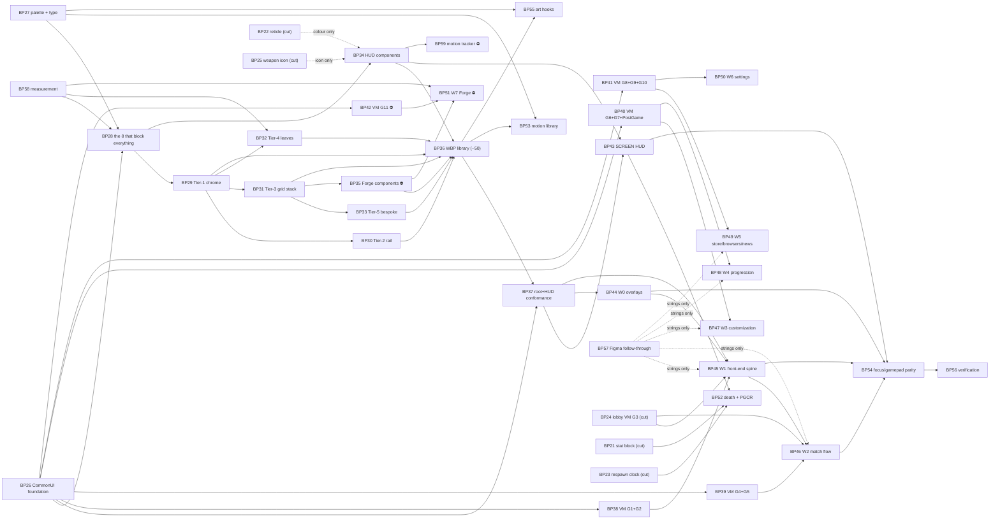

# PROPOSED TICKETS — the UE 5.8 front-end build (BP26–BP59)

> **STATUS: proposal — nothing here is cut.** No file exists in `docs/tickets/` for any id below
> and none should until the founder approves. Thirty-four packets, numbered from BP26 because
> BP00–BP25 are taken. Each block carries the fields a real ticket needs; when one is approved it
> expands into `docs/tickets/TICKET_BP<nn>_<SLUG>.md` against `TICKET_TEMPLATE.md` verbatim —
> Kickoff, Steps, Done when, Notes, Log.
>
> **v2, rewritten 2 Aug 2026** after three founder decisions landed (scope 31 screens, N6 keep
> `Team Slayer`, stage 3a executed). The v1 body was scoped to eleven screens on the opposite
> assumption and said so openly; that assumption is dead and the board is rebuilt around
> `docs/ui/ue-frontend/SCREEN-MANIFEST.md`, which is the authority on which screens exist, which
> Figma frames collapse into one WBP, and in what wave. The v1 ADDENDUM is gone — its content is
> woven in below.

---

## 0. What exists today, verified

**C++ (`Source/Breachpoint/UI/`, 7 units, landed by BP10 step 1, commit `2075f8b`):**
`BRUITypes` (4 `Layer.*` UI tags, `EBRUIDataState`, `EBRHitMarkerKind`, `FBRKillfeedViewEntry`,
`FBRCombatAttributeBindings`) · `BRUISettings` (config developer-settings: six `TSoftClassPtr`
screen slots, killfeed limits, two MVVM context names) · `BRRootLayout` (four
`UCommonActivatableWidgetStack` `BindWidget` slots + a tag→stack map) · `BRActivatableWidget` ·
`BRHUDLayout` (+ `UBRKillfeedEntryWidget`, `FUserWidgetPool`) · `BRUIManagerSubsystem` ·
`BRViewModels` (`UBRVM_Combat`, `UBRVM_Match`). Every class is `meta = (DisableNativeTick)`.
Sound foundation; none of it should be rewritten.

**Assets (`Content/UI/`, 3 files):** `WBP_RootLayout`, `WBP_HUDLayout`, `WBP_KillfeedEntry` —
against the manifest's 50 proposed C++ classes and its 31-to-40 WBPs (see F5). **No component
class exists. No screen exists.**

**Three of the seven units are UNDECLARED** in `BREACHPOINT-ARCHITECTURE.md` §3 —
`BRRootLayout`, `BRUISettings`, `BRUITypes` (`BUILD-STATE.md`). That is **D11**, unanswered.

**Figma, as of stage 3a (`ART-PASS-STAGE-3.md` §8):** 176 instances repointed to
Breachpoint-owned mains, zero errors, **zero node-count drift** across all twelve `FE / …` pages.
The FE screens instance **80 distinct mains** — 48 already ours (500 instances), 12 swapped
(176), 4 needing human variant mapping (48), and **17 with no equivalent that must be authored
(177)**. `Button Prompts` (69) and `Navigation Bar` (29) are **98 of that 177**.

---

## 1. What is already ticketed — not duplicated here

| Ticket | Covers | Relationship |
|---|---|---|
| **BP10** HUD + front end | the whole surface in five steps | **This proposal is BP10 decomposed.** Step 1 landed; steps 2–4 are this entire document behind three checkboxes, which is why nothing has moved. If approved, BP10 becomes the parent and closes by reference — **it is not ours to edit** (law 5). |
| **BP21** stat block | `FBRPlayerStatBlock` + `UBRVM_Scoreboard` | Consumed by BP52. Also the already-filed half of the manifest's `UBRVM_PostGame`. |
| **BP22** reticle state | `EBRReticleTargetState` on `UBRVM_Combat` | Consumed by BP34/BP43. |
| **BP23** respawn countdown | replicated float + `UBRVM_Match` clock | Consumed by BP52. |
| **BP24** lobby ViewModel | `UBRVM_Lobby` over the ten session delegates | **This is the manifest's gap G3**, which gates Waves 1–2 and therefore the board. Not restated; promoted to a hard gate on BP45/BP46. |
| **BP25** weapon icon | `IconSoftPath` on `FBRWeaponRow` → VM | Consumed by BP34/BP43. |
| **BP18** asset batch | R37 asset-landing discipline | The precedent every `editor-live` packet here follows. |

**BP24 covers exactly one of the manifest's eleven ViewModel gaps.** The other ten are BP38–BP42,
and they — not the widgets — are the front end's real critical path.

---

## 2. The four cuts that decide the numbering

**(a) Law 5 forces a folder-per-packet.** `guard_laws.py` enforces `owner_path` at *folder*
granularity, so packets sharing `Source/Breachpoint/UI/` pass the hook and then collide on files
— the failure HANDOFF session 4 records twice. Hence:

```
Source/Breachpoint/UI/Components/{Core,Chrome,Rail,Grid,Leaf,Bespoke,HUD,Forge}/
Source/Breachpoint/UI/Screens/{HUD,OV,FE,MM,OP,PR,SH,ST,FG,PGCR}/
Source/Breachpoint/UI/ViewModels/        (BP38–BP42: disjoint FILES in one folder, see Wave 2)
Content/UI/Components/<mirrored>/ · Content/UI/Screens/<mirrored>/
```

Creating those subfolders changes what `Tools/architect/build_state.py` scans and what
`BREACHPOINT-ARCHITECTURE.md` §3 declares. **Filed as a `contract_gap` on BP28, not fixed
inline.**

**(b) The component packets are cut by DEPENDENCY TIER, not by family — and this is the one
structural change v2 makes.** The coordinator asked me to verify the component layer stands.
**The component *set* stands; the *packet boundaries* did not.** `SCREEN-MANIFEST.md` §5's seven
Tier-0 components — `UBRProfileBar`, `UBRButtonPrompt`, `UBRScrim`, `UBRMenuRow`,
`UBRButtonBorder`, `UBRScrollBar`, `UBRRule` — landed in **four different** v1 packets (Chrome,
Panels, Roster, Items). Under a family cut, "Tier-0 first" is not executable as a wave: it needs
four claims, four owner paths and four builders to produce the 15% of work that carries 100% of
the dependency. Recut by tier, it is one packet.

**(c) R36 + R37 force C++ before assets, in separate sessions.** Component classes land with the
editor **closed** (`engine-installed`); WBPs land later, `editor-live`, with a committed plan and
a receipt. A packet asking for both is unexecutable and would be discovered at claim time.

**(d) One deliberate deviation from the manifest's tiering: `UBRNavBar` is pulled from Tier 1
into BP28.** Two independent rankings agree on it — the UE dependency graph (18 of 31 screens)
and the Figma instance count (29 of the 177 to author, second only to `Button Prompts` at 69).
Both of BP28's headline items are the same two components from both directions. The deviation is
recorded because it contradicts §5's printed tier, and a deviation nobody wrote down is a bug.

---

## 3. The tickets

Format: **id · title · owner · deps · owner_path · contracts · in · out · done (rung) · size ·
risks.** Size: **S** ≈ one session · **M** ≈ two–three · **L** ≈ a week of sessions. Rungs are
`contracts/testing.md`'s. **A rendered PNG (`ui-presentation` §7, `SCREEN-MANIFEST.md` §11) is an
artifact, not a rung.**

---

### BP26 — CommonUI foundation: the layers are built and nothing mounts them

- **Owner:** ui-builder · verifier · critic · **Deps:** none · **requires:** `engine-installed`
  (+ one `editor-live` step for the CommonInput controller data assets — see risks)
- **owner_path:** `Source/Breachpoint/UI/`, `Config/DefaultGame.ini`, `Config/DefaultInput.ini`
- **Contracts:** `data-and-assets.md` (soft class refs; config over asset) · `testing.md`
  (rungs 1–3, grep gates) · skills `ue5-ui-architecture`, `ui-presentation` §8 ·
  `SCREEN-MANIFEST.md` §3 (layer routing)
- **In:** `UBRUIManagerSubsystem::CreateLayoutForLocalPlayer` is never called by anything — wire
  it to the `ULocalPlayer` path and prove a root layout is on screen. `UCommonGameViewportClient`
  as the viewport class. `CommonUISettings`/`CommonInputSettings` in `DefaultGame.ini` (**config,
  not a BP** — R26's closing preference). The six `TSoftClassPtr` slots pointed at real classes.
  Input routing proven: a `Layer.Menu` widget over a `Layer.Game` one actually changes input
  mode, and **back pops the stack** rather than being hand-rolled (`ue5-ui-architecture` §6).
- **OUT:** any component (BP28+), any screen (BP43+), any WBP (BP36), gamepad *parity* (BP54).
- **Done (rung):** rung 1 on three targets · rung 2: grep proves zero `NativeTick` and zero UMG
  property bindings across `UI/`; a spec asserts push/pop ordering and that `Layer.Modal`
  suppresses Game-layer input · **rung 3**: a root layout mounts for LP0 and the HUD layer
  receives the HUD widget · rung 4a: a second client gets its own layout and its own VM instance.
- **Size:** M
- **Risks:** ① `UCommonInputBaseControllerData` is a data asset with no C++ path and is **not on
  `BREACHPOINT-AUTHORING-MATRIX.md` Tier 4's closed list.** Law 7's standing question has no
  answer on file — **file it; do not create the asset and argue after** (F3). ② D11. ③ HANDOFF's
  D5 ("two one-line fixes that stop the module compiling") is unresolved on the register while
  HANDOFF says the module builds; one of the two is stale and nobody has checked.

---

### BP27 — One palette, one type ramp, and nowhere to type a hex

- **Owner:** ui-builder · tuning-curator (proposes rows) · critic · **Deps:** none ·
  **requires:** `engine-installed`
- **owner_path:** `Source/Breachpoint/UI/`, `Content/Data/DT_UIPalette.csv`,
  `Content/Data/DT_UIType.csv`
- **Contracts:** `data-and-assets.md` (**governing** — one source of truth per kind, text over
  binary) · `ui-presentation` §3, §9 · `SCREEN-MANIFEST.md` §7.4, §11 · `testing.md` (rungs 1–2)
- **In:** `FBRUIPaletteRow` / `FBRUITypeRow` in **`UI/BRUITokens.h`** — not `Data/BRDataRows.h`,
  because `Data/` belongs to BP03/BP13 and law 5 says file the gap, not the edit. Rows for the
  six VISR channels, the five discrete black alphas, the four rarity pairs, the three stroke
  weights (1px chrome ×404, 0.5px rules ×323, 2px tiles ×177) and **radius 0** — sharp corners
  are the language. Type ramp on Rajdhani (OFL) with **percent** letter-spacing
  (`COMPONENT-SPECS.md` §0's first correction: 15%/10%/8%, not unitless). A `UBRUITokens`
  accessor every widget reads.
- **OUT:** applying tokens (each component packet does its own), motion curves (BP53), art
  (BP55), any gameplay number.
- **Done (rung):** rung 1 · rung 2: every token named in `UI-DESIGN-SYSTEM.md` §2 and
  `COMPONENT-SPECS.md` §8 resolves, and **the grep gate proves zero hex literals under
  `Source/Breachpoint/UI/`** · CSVs re-import clean.
- **Size:** S
- **Risks:** the shield cyan disagrees across two docs (`#2ec3e5` vs `#35D0F2`) and
  `COMPONENT-SPECS.md` §8 already rules **two tokens, not one rounded compromise** — HUD keeps
  ours, file-matching uses theirs. `Content/Data/` is shared with BP13; lock or split.

---

### BP28 — The eight components that block every screen

- **Owner:** ui-builder · critic · **Deps:** BP26, BP27, **BP58** (hard, for `UBRNavBar` only) ·
  **requires:** `engine-installed`, editor CLOSED
- **owner_path:** `Source/Breachpoint/UI/Components/Core/`
- **Contracts:** `data-and-assets.md` (R18/R26) · `COMPONENT-SPECS.md` §1–§3 ·
  `SCREEN-MANIFEST.md` §5 (tiers), §2 (naming law), §4.0 (invariants) · `testing.md` (rungs 1–2)
- **In:** the seven Tier-0 plus `UBRNavBar` (§2d). `UBRProfileBar` (1280×50 @ y=670,
  `#000000@0.5` + BACKGROUND_BLUR, **always reserved**, 31/31) · `UBRButtonPrompt` (31/31; **69
  Figma instances, the largest single authoring win in the art pass**; width tracks prompt count
  58/62 · 133/146 · 253, so **auto-layout hug, never fixed**) · `UBRScrim` (31/31) ·
  `UBRMenuRow` (250×28, **26/31 — the highest-leverage class in the project**; the 27-variant
  matrix is ONE class with a Type enum and a Status enum, not 27 files; hover **inverts**, it
  does not highlight) · `UBRButtonBorder` (the four-line partial border every panel reuses,
  26/31) · `UBRScrollBar` (slim 8×N, wide 13×N, 14/31) · `UBRRule` (12/31) · `UBRNavBar`
  (666×30 root / 516×30 sub, four tabs at pitch 150, 3px OUTSIDE stroke when active, 18/31).
- **OUT:** every WBP (BP36), every other tier (BP29–BP35), any screen.
- **Done (rung):** rung 1 on three targets · rung 2: a spec instantiates all eight headless,
  asserts declared `BindWidget` slot names match the contract BP36 builds to, and asserts every
  colour comes from BP27's tokens · `SCREEN-MANIFEST.md` §11's self-check answered item by item
  in the Log.
- **Size:** M
- **Risks:** ① **`UBRNavBar` cannot start until the nav-bar x conflict closes** — `x=33`
  (`COMPONENT-SPECS.md` §6, a live-node read) vs `x=44` (`SCREEN-BUILD-SPEC.md` §1). **18 screens
  inherit the error.** That is BP58's Q1 and it is one node read; the other seven are unblocked.
  ② The `Components/Core/` subfolder is §2(a)'s `contract_gap` — **file it before creating the
  folder.** ③ `Main Button`'s 27 variants read as 27 classes to anyone taking the table literally.

---

### BP29 — Tier-1 page chrome

- **Owner:** ui-builder · critic · **Deps:** BP28 · **requires:** `engine-installed`
- **owner_path:** `Source/Breachpoint/UI/Components/Chrome/`
- **Contracts:** as BP28, plus `SCREEN-BUILD-SPEC.md` §1, §3.5 (title band 75 ↔ 105)
- **In:** `UBRPageTitle` (1280×75, Drill Down / Single Page, 15/31) · `UBRItemTitle` (1280×105,
  three rarity variants, 6/31 — **it replaces the Page Title and everything below shifts up
  40px**) · `UBRDescriptionStrip` (349×37 italic, 7/31) · `UBRHighlightButton` (13 variants,
  11/31) · `UBRSmallHeader` (1180×27) · `UBRGroupLabel` (18px caps, distinct from Small Header).
- **OUT:** WBPs (BP36), any screen.
- **Done (rung):** rung 1 · rung 2: the title-band swap asserted — a screen at Item level
  measures 105 and its content origin is exactly 40px higher.
- **Size:** S

---

### BP30 — Tier-2: the front-end rail

- **Owner:** ui-builder · critic · **Deps:** BP28, BP29; **soft** BP38 · **requires:**
  `engine-installed`
- **owner_path:** `Source/Breachpoint/UI/Components/Rail/`
- **Contracts:** `netcode.md` law 7 (a roster is *the* late-arriving-state surface) ·
  `COMPONENT-SPECS.md` §4, §6 · `SCREEN-MANIFEST.md` §5 Tier 2 · `testing.md` (rungs 1–2)
- **In:** `UBRLeftRail` (`Menu Combo` 349×510 @ (69,138) — **the shipped variant** per
  `COMPONENT-SPECS.md` §6's footnote; the other is a stale layer, 6/31) · `UBRFeatureCard`
  (349×222, 4/31) · `UBRRosterPanel` (`Party List` 349×273, 5/31) · `UBRRosterRow` (390×30 / 349
  in-panel; the **−5 gap** on External Icons is deliberate overlap) · `UBRRosterHeader`
  (1180×31) · `UBRMicIcon` · `UBRRankInsignia` · `UBRProgressionButton` (334×115 @ (869,55),
  3/31) · `UBRLoadBar` (1280×50, Loading / Searching / Searching 2, 3/31) · `UBRCarouselDots`
  (4/31) · `UBRTeamLabel` (1180×32).
- **OUT:** WBPs (BP36), the screens (BP45–BP46), the ViewModels (BP38), rank insignia **art**
  (BP55).
- **Done (rung):** rung 1 · rung 2: a spec feeds `UBRRosterRow` a null/partial player record and
  asserts an honest empty state via `EBRUIDataState` — never a garbage frame (netcode law 7).
- **Size:** M
- **Risks:** ① **lobby roster width 349 vs 310 is UNMEASURED** (Q2). ② `UBRFeatureCard` is 330 on
  the component board and 349 in-screen (Q13) — the same discrepancy class as Player Buttons
  390/349. ③ `UBRLoadBar`'s internal anatomy is unread (Q7). All three are BP58's; a constant
  invented here is inherited by five screens.

---

### BP31 — Tier-3: the grid stack

- **Owner:** ui-builder · critic · **Deps:** BP28, BP29 · **requires:** `engine-installed`
- **owner_path:** `Source/Breachpoint/UI/Components/Grid/`
- **Contracts:** `COMPONENT-SPECS.md` §5 (the 114×114 tile, exact) · `SCREEN-BUILD-SPEC.md` §1
  (grid math), §2 (the two-state frame) · `testing.md` (rungs 1–2)
- **In:** `UBRItemTile` (114 / mini 30, four rarities; 100 outer → 80 border → 70 art; rarity
  lives on the **bottom line only**, 10/31) · `UBRItemGrid` (tile 114, pitch 130, 4 cols = 504,
  origin (86,260), scrollbar 8×374 at x=62) · `UBRMenuList` (536×446/542, 4/31) · `UBRFilterBar`
  (536×53) · `UBRGearDetail` (586×161, **shrinking to 586×125** at channel level because
  materials carry no maker row, 4/31) · `UBRCurrency` (256×74) · `UBRCurrencyRow` (216×34 @
  (992,47), 6/31) · **`UBRTwoStateFrame`** — the list↔grid switch of `SCREEN-BUILD-SPEC.md` §2,
  *the single most consequential structural finding in the spec*: getting it wrong doubles the
  widget count of Waves 3 and 5 for no reason.
- **OUT:** WBPs (BP36), the customization/store screens, the Color Picker (BP33).
- **Done (rung):** rung 1 · rung 2: grid arithmetic asserted; `UBRTwoStateFrame` driven through
  both states with §1's invariants asserted in each (profile bar reserved, right band `x≥650`
  clear except `Gear Detail` and `Currencies`).
- **Size:** M
- **Risks:** the two-state frame's absence is invisible until six screens have been built twice.
  Land it first inside the packet.

---

### BP32 — Tier-4: the leaf components

- **Owner:** ui-builder · critic · **Deps:** BP28, BP29, **BP58** (for one class) ·
  **requires:** `engine-installed`
- **owner_path:** `Source/Breachpoint/UI/Components/Leaf/`
- **Contracts:** as BP31, plus `REFERENCE-EXTRACTION.md` §5 (variant axes)
- **In:** the twenty of §5 Tier 4 — `UBRStoreCard` (280×245 / Wide 570×245) · `UBRPriceTag` ·
  `UBRFileCard` (157×132) · `UBRTableRow` (660×28, **Type=Servers | Files — this one axis is what
  lets a single widget serve both browsers**) · `UBRRating` · `UBRDropDown` · `UBRCheckbox` ·
  `UBRRadio` · `UBRSliderRow` (138×26) · `UBRTagFrame` · `UBRPreviewPhoto` /
  `UBRThreePhotoPreview` (330×158) · `UBRChallengeCard` (364×68/54) · `UBRCommendationCard` ·
  `UBRProgressBar` · `UBRGameSettings` (349×469) · `UBRCountdown` (324×152) · `UBRFileDetail` ·
  `UBRPopupOptions` (451×682) · `UBRWarningMessage` (349×60) · `UBRShopPassesCard`
  (**omitted until BP58 sources it — see risks**).
- **OUT:** WBPs (BP36), bespoke components (BP33), any screen.
- **Done (rung):** rung 1 · rung 2: geometry constants asserted; each class's variant axes match
  `REFERENCE-EXTRACTION.md` §5's count exactly.
- **Size:** L (twenty classes, each individually small)
- **Risks:** **`UBRShopPassesCard` is not specifiable from any source.** It appears in
  `ART-PASS-STAGE-3.md` §3's list and nowhere else — no node id, no geometry, not in
  `REFERENCE-EXTRACTION.md` §5, not in `COMPONENT-SPECS.md`. `SCREEN-MANIFEST.md` §6.8 says
  plainly: *do not author it from inference* — a wrong 8th component blocks the repoint as
  effectively as a missing one. It is **omitted, not guessed.** Also unread: `UBRTableRow`'s
  internal column stops (Q6) and `UBRPopupOptions`/`Menu in Border` row counts (Q8).

---

### BP33 — Tier-5: the bespoke components no reference kit contains

- **Owner:** ui-builder · critic · **Deps:** BP28, BP31 · **requires:** `engine-installed`
- **owner_path:** `Source/Breachpoint/UI/Components/Bespoke/`
- **Contracts:** `SCREEN-BUILD-SPEC.md` §5 (**the source for every component here**) ·
  `data-and-assets.md` · `testing.md` (rungs 1–2, 5)
- **In:** `UBRColorPicker` (373×220 — the SV field is **not a continuous gradient**; it is a 6×6
  grid of flat 55×32.667 cells with whole-cell selection, deliberately D-pad navigable; hue rail
  with a caret that **overshoots by 1px top and bottom**) · `UBRRewardTrack` (1156 viewport, tile
  rail pitch 130 + chip rail pitch 260, content to x=3510) · `UBRPreviewPanel` (819×720 with a
  diagonal boolean mask) · `UBRProgressionRow` (1143×193, **hideable 3rd column sharing x=794 —
  the column count is data-driven**) · `UBRCountdownChip` (88×40) · `UBRBumperTabStrip` (284×36)
  · `UBRInputMapDiagram` (591×291 — the class only; the art is BP55's and **must be original**)
  · `UBRCRTScanline` (**ship as a gradient, NOT the 180 authored rects**).
- **OUT:** WBPs (BP36), Forge's bespoke set (BP35), the art (BP55).
- **Done (rung):** rung 1 · rung 2: the colour picker's quantisation asserted (36 cells,
  whole-cell selection, no interpolation) · rung 5 on `UBRRewardTrack`, the only component here
  that scrolls 3510px of content.
- **Size:** M
- **Risks:** **`UBRColorPicker` has two callers in two waves (3 and 7).** `SCREEN-MANIFEST.md` §5
  names building it twice as *"the most likely duplication in this plan"*. Build it once here.

---

### BP34 — The in-match HUD component classes

- **Owner:** ui-builder · critic · verifier · **Deps:** BP28; **soft** BP22, BP25 ·
  **requires:** `engine-installed`
- **owner_path:** `Source/Breachpoint/UI/Components/HUD/`
- **Contracts:** `gas-purity.md` (boundary only — the HUD reads, never mutates) · `netcode.md`
  law 5 (**hidden state — the HUD is where a wallhack ships**) · `ui-presentation` §3, §4 ·
  `testing.md` (rungs 1–2, 5)
- **In:** `UBRVitalsWidget` (shields-over-health) · `UBRAmmoBlock` · `UBRWeaponTray` (text half
  binds today; icon half waits on BP25) · `UBRGrenadeCounter` · `UBRGrappleRing` ·
  `UBRReticleWidget` (**geometry constant across states, colour token only** — BP22's binding
  constraint, restated because this is the class that can violate it) · `UBRHitMarker` (four
  kinds, already events on `UBRVM_Combat`) · `UBRKillfeedRow` · `UBRMatchBanner`.
- **OUT:** the HUD screen assembly (BP43), the motion tracker (BP59), the death overlay (BP52),
  medal art (BP55), audio (BP10 step 4).
- **Done (rung):** rung 1 · rung 2: grep proves no widget reads the pawn, the ASC or the
  GameState directly — **every value comes off a ViewModel**; a spec asserts the reticle's
  non-colour geometry is byte-identical across all five `EBRReticleTargetState` values · **rung
  5**: widget count and `stat unit` delta against `BREACHPOINT-QUALITY-BARS.md` §2.
- **Size:** L
- **Risks:** ① BP22's four open questions are unanswered and three change this class's public
  surface. ② `UI-DESIGN-SYSTEM.md` §5's anchor layout was **superseded mid-document** — build to
  the superseding text (Infinite's four anchors) and say so, or the next reader builds to the
  struck-through paragraph.

---

### BP35 — Forge's bespoke components ⛔ recommend not cutting

- **Owner:** ui-builder · critic · **Deps:** BP31, BP33 · **requires:** `engine-installed`
- **owner_path:** `Source/Breachpoint/UI/Components/Forge/`
- **Contracts:** `SCREEN-BUILD-SPEC.md` §4 (the only source) · `testing.md` (rungs 1–2)
- **In:** `UBRRadialMenu` (366×366, hub 130×130, Exit 62×62 @ (152,152) so its centre is the ring
  centre, which lands on 640,360) · `UBRRadialQuadrant` (**overlapping 366×136 / 136×366 slabs,
  not pie slices** — they overlap in all four corners and the wedge comes from a boolean fill
  inside the component; z-order Bottom→Right→Left→Top) · `UBRThumbstickIndicator` (35×5, **one
  asset rotated in 90° steps, not four**) · `UBRBreadcrumbStepper` (`← LABEL →` — back control
  *and* sibling pager in one row) · `UBRInPlaceExpandingTree` (**vertical centre pinned at y=360
  across all three levels; animate height and y together**; rows 28 @ pitch 29 in a 336 panel —
  **NOT the front end's 250/40**) · `UBRTransformReadout` (82px label column + 298px value pane).
- **OUT:** the Forge screens (BP51), the ViewModel (BP42).
- **Done (rung):** rung 1 · rung 2: the accordion's centre-pin asserted arithmetically
  (273.5+86.5 = 288+72 = 244.5+115.5 = 360).
- **Size:** M
- **Risks:** the geometry is unusually well specified and **the screens are not** — the
  `Refences - Forge` page is named and its frames carry no node ids anywhere in the repo (Q9).
  More fundamentally: **no shipped-scope document gives Breachpoint a map editor** (F7). This
  packet *could* land; BP51 could not. Listed for completeness.

---

### BP36 — The WBP component library: the asset half of BP28–BP35

- **Owner:** ui-builder (drives the editor) · critic (reviews the receipt, not the asset) ·
  verifier
- **Deps:** BP28 (hard); BP29–BP35 per family · **requires:** `editor-live` — **and R29/R36: no
  build, no commandlet, nothing that takes the project lock, for the duration**
- **owner_path:** `Content/UI/Components/{Core,Chrome,Rail,Grid,Leaf,Bespoke,HUD,Forge}/`,
  `Tools/ui_wbp/` (the committed plan)
- **Contracts:** `data-and-assets.md` (R18 Tier 4 — **layout, anchors and animation only**) ·
  **R26's five conditions applied to WBPs exactly as to `BP_BR*`** · **R37** (committed plan +
  receipt, both) · `SCREEN-MANIFEST.md` §2 (**the WBP name is mechanically derived: strip `UBR`,
  prefix `WBP_` — that is what makes an audit possible**), §7.1 (exactly one `UCanvasPanel`, at
  the root), §7.2 (author at 1280×720; the DPI curve does 1920)
- **In:** one WBP per landed component class — roughly **fifty**. **Claimable per family**; each
  sub-claim locks only its own `.uasset` set (law 7), which is why the owner_path is eight
  folders and not one.
- **OUT:** any graph node, any variable, any gameplay number, any screen composition, any C++
  change (that is a `contract_gap` back to BP28–BP35).
- **Done (rung):** rung 1 after the editor closes (author → close → build) · **rung 2 gains the
  WBP audit** — `Tools/audit_blueprints/audit_r26.py` extended to WBPs and **actually wired into
  the rung-2 pass**, asserting node count 0, added-member count 0, and parent class derived from
  the asset name. R26's own text says the script *"is unreviewed, has never been run, and is not
  wired into rung 2"* — **this packet closes that**, or R26 stays enforced by goodwill while
  fifty assets are added under it. · A receipt per family, committed.
- **Size:** L — **and it grew.** ~30 assets against eleven screens in v1; ~50 now.
- **Risks:** ① the R26 audit does not work today, and its existence is not enforcement — the
  sixth instance of HANDOFF's *"a mechanism that reads as enforced and is not"*. ② **R29.2: one
  editor, one driver.** The eight families look independent and cannot be parallelised. ③ Every
  hour this packet holds the editor, rung 1 is unavailable to the whole board.

---

### BP37 — `WBP_RootLayout` and `WBP_HUDLayout` conform to their C++ contract, or they do not

- **Owner:** verifier (leads) · ui-builder (repairs) · critic · **Deps:** BP26, BP36 ·
  **requires:** `editor-live`
- **owner_path:** `Content/UI/WBP_RootLayout.uasset`, `Content/UI/WBP_HUDLayout.uasset`,
  `Content/UI/WBP_KillfeedEntry.uasset`
- **Contracts:** `testing.md` (rungs 1–3) · R26/R18 · R37 · `SCREEN-MANIFEST.md` §4.0
- **In:** three assets exist and **nothing has ever asserted they satisfy the classes they claim
  to parent.** `UBRRootLayout` declares four `BindWidget` stacks; a missing one is a widget error
  nobody has seen because nothing loads them. `UBRHUDLayout::KillfeedContainer` is
  `BindWidgetOptional`, so its absence is *silent*. Then land §4.0's invariants — title-safe
  overlay, profile bar, prompt bar, scrim — **in the root layout, once, so no screen repeats
  them.**
- **OUT:** authoring HUD content into `WBP_HUDLayout` (BP43 does that against a conformed asset).
- **Done (rung):** **rung 3** — the editor loads all three with zero binding warnings and PIE
  mounts them · rung 2: a test that fails loudly when a required `BindWidget` slot goes missing,
  proven red-then-green against a deliberately broken copy.
- **Size:** S

---

### BP38 — ViewModels G1 + G2: `UBRVM_Player`, `UBRVM_FrontEnd`

- **Owner:** ui-builder · verifier · critic · **Deps:** BP26 · **requires:** `engine-installed`
- **owner_path:** `Source/Breachpoint/UI/ViewModels/BRVM_Player.{h,cpp}`,
  `BRVM_FrontEnd.{h,cpp}` — **one VM per file, granted by exact path** (R25's precedent), so
  BP38–BP42 can run as pods inside one folder
- **Contracts:** `data-and-assets.md` (menu definitions and news copy are **data**, not literals)
  · `netcode.md` law 7 · `online-services.md` · `testing.md` (rung 2) · `SCREEN-MANIFEST.md` §10
- **In:** `UBRVM_Player` (gamertag, emblem, career rank, rank %, credits, marks — **8 screens**)
  and `UBRVM_FrontEnd` (carousel entries, per-tab menu-row lists, focused-row description text —
  **4 screens**). Built exactly like `UBRVM_Combat`: `BindTo…`/`UnbindFrom…` pairs,
  `ClearToUnknown()`, `EBRUIDataState` per group, FieldNotify throughout, every handler unbound
  in `BeginDestroy`. Zero polling, zero `NativeTick`, zero property bindings.
- **OUT:** any screen; `UBRVM_Lobby` (**that is BP24, G3** — BP24 plus this packet are the three
  ViewModels that gate Wave 1 and therefore everything downstream).
- **Done (rung):** rung 1 · rung 2: both VMs driven through every state including the honest-
  empty one against a fake source; grep proves every bind has a matching unbind **in both
  directions** — a missing unbind is a crash, not a leak.
- **Size:** M
- **Risks:** ① `UBRVM_Player` needs a save-profile and a Steam identity surface that **may not
  exist**; if it does not, that is a `contract_gap` against BP11, not an edit (law 5). ② The
  menu-definition table G2 reads does not exist — file it against BP13 rather than hard-coding a
  menu tree in C++.

---

### BP39 — ViewModels G4 + G5: `UBRVM_Roster`, `UBRVM_CustomGame`

- **Owner:** ui-builder · verifier · critic · netcode-builder (consults) · **Deps:** BP26, BP24 ·
  **requires:** `engine-installed`
- **owner_path:** `Source/Breachpoint/UI/ViewModels/BRVM_Roster.{h,cpp}`,
  `BRVM_CustomGame.{h,cpp}`
- **Contracts:** `online-services.md` · `netcode.md` law 7 (**seamless travel re-creates actors
  and `PlayerArray` is momentarily empty** — BP24's critic list applies verbatim) · `testing.md`
  (rungs 2, 4b)
- **In:** `UBRVM_Roster` (squad, friends, recents, presence, invite/block state — 4 screens) and
  `UBRVM_CustomGame` (the settings tree, per-team slots, spectators, start-eligibility — 2).
- **OUT:** the friends/presence *service* (BP11), the screens (BP46).
- **Done (rung):** rung 1 · rung 2 against a fake service including **every failure path — a
  roster is mostly failure paths** · rung 4b in threes on a real host/join.
- **Size:** M · **Risks:** blocked on D9 for its only meaningful rung.

---

### BP40 — ViewModels G6 + G7 + PostGame: customization and progression

- **Owner:** ui-builder · verifier · critic · **Deps:** BP26; **soft** BP21 · **requires:**
  `engine-installed`
- **owner_path:** `Source/Breachpoint/UI/ViewModels/BRVM_Customization.{h,cpp}`,
  `BRVM_Progression.{h,cpp}`, `BRVM_PostGame.{h,cpp}`
- **Contracts:** `data-and-assets.md` (**every item, rank and reward is a row, not a literal**) ·
  `testing.md` (rung 2)
- **In:** `UBRVM_Customization` (slots, grid items with soft art pointers, rarity,
  owned/locked/favourite, focused-item detail, filter+sort state — 5 screens) ·
  `UBRVM_Progression` (career rank, rank index 0–15, XP, track nodes, claim state, challenges,
  commendations, battle-pass tiers — 7 screens) · `UBRVM_PostGame` composed over BP21's
  `UBRVM_Scoreboard`.
- **OUT:** the screens (BP47, BP48, BP52), the economy itself, medal art (BP55).
- **Done (rung):** rung 1 · rung 2: the 16-rank ladder resolves against
  `ART-PROMPT-LIBRARY.md:355`'s committed names; every art reference is a **soft** pointer and
  empty-is-legal (BP25's precedent).
- **Size:** M
- **Risks:** ① **no inventory, no economy and no progression system exists in `Source/`.** These
  VMs bind to tables and services nobody has built — a `contract_gap` per field, not an
  invitation to invent one. ② N2, N4 and N5 are unanswered and are this VM's display strings. ③
  The repo holds **two irreconcilable medal lists** — 11 shipped rows in `DT_Medals.csv` vs 16
  doc-only names; nine shipped medals with no icon, eight icons with no medal.

---

### BP41 — ViewModels G8 + G9 + G10: store, browser, settings

- **Owner:** ui-builder · verifier · critic · **Deps:** BP26 · **requires:** `engine-installed`
- **owner_path:** `Source/Breachpoint/UI/ViewModels/BRVM_Store.{h,cpp}`, `BRVM_Browser.{h,cpp}`,
  `BRVM_Settings.{h,cpp}`
- **Contracts:** `data-and-assets.md` (**settings labels and error text are data, not a `switch`
  full of literals** — BP24 step 3's precedent) · `testing.md` (rung 2)
- **In:** `UBRVM_Store` (sections, offers, wallet, ownership, expiry — 4 screens) ·
  `UBRVM_Browser` (source Files|Servers × view Cards|Table × selection-mode, entries, filter,
  sort, selection set — 2 screens covering **8 Figma frames**) · `UBRVM_Settings` (categories,
  settings with type/value/range/options/default/description, dirty flag, keybind map).
- **OUT:** the screens (BP49, BP50), payment of any kind.
- **Done (rung):** rung 1 · rung 2: settings round-trip — write, reload, read back — proven by a
  spec; the browser's three axes driven independently.
- **Size:** M
- **Risks:** settings is the one front-end surface that writes to disk. A half-built save path is
  a data-loss bug, not a UI bug; **do not simplify it away.**

---

### BP42 — ViewModel G11: `UBRVM_Forge` ⛔ recommend not cutting

- **Owner:** ui-builder · **Deps:** BP26 · **requires:** `engine-installed`
- **owner_path:** `Source/Breachpoint/UI/ViewModels/BRVM_Forge.{h,cpp}`
- **In:** object palette, categories, selected object, transform, material tree, colour state.
- **Done (rung):** rung 1 · rung 2. · **Size:** S
- **Risks:** it feeds four screens with no node ids (Q9) and an editor that does not exist (F7).
  Listed for completeness.

---

### BP43 — Screen: the in-match HUD, assembled on four anchors

- **Owner:** ui-builder · verifier · critic · **Deps:** BP34, BP36, BP37; **soft** BP22, BP25 ·
  **requires:** `editor-live`
- **owner_path:** `Content/UI/Screens/HUD/`, `Source/Breachpoint/UI/Screens/HUD/`
- **Contracts:** `ui-presentation` §3, §4, §11 · `netcode.md` law 7 · `testing.md` (rungs 3, 4a,
  4b, 5) · R37
- **In:** compose BP34's classes on the four anchors ruled in `UI-DESIGN-SYSTEM.md` §5 —
  top-centre survivability, bottom-left awareness, bottom-centre match state, bottom-right
  loadout, centre reticle; killfeed top-right. Every value bound through `UBRVM_Combat` /
  `UBRVM_Match`, which **already serve every field this screen needs except reticle colour**.
- **OUT:** the motion tracker (BP59), the death overlay (BP52), the scoreboard (BP52), audio,
  any new C++ field — that is a `contract_gap`, not a widget workaround.
- **Done (rung):** rung 3 · **rung 4a in threes** (server, acting client, observing client agree
  on shields, ammo, killfeed) · **rung 4b**, because the slice ships a listen server and the host
  runs prediction and authority in one call stack (R30's whole argument) · rung 5 · a 1600×900
  render committed as the review artifact.
- **Size:** L
- **Risks:** join-in-progress is where every HUD lies; `EBRUIDataState` exists to prevent it and
  nothing has exercised it. The reticle will look finished and be dead until BP22 lands.

---

### BP44 — Screens: Wave 0 — the overlays and modals every other wave needs

- **Owner:** ui-builder · critic · **Deps:** BP28, BP29, BP32, BP36, BP37 · **requires:**
  `editor-live`
- **owner_path:** `Content/UI/Screens/OV/`, `Source/Breachpoint/UI/Screens/OV/`
- **Contracts:** `SCREEN-MANIFEST.md` §4.8, §3 (layer routing) · R37 · `testing.md` (rung 3)
- **In:** four assets, **built with the foundation and not last**, because every wave needs them.
  `WBP_Modal_Warning` (takes an `FBRConfirmRequest` payload, **not a ViewModel** — confirm/cancel
  resolve a delegate on the caller) · `WBP_Modal_Options` (451×682 at x=48 over a full scrim —
  **`Pop-Up Options` and `Gear Filters` are one component with two variants**, and it is not a
  navigation level) · `WBP_Overlay_ChallengePane` (1298×546 — **overscans 1280; anchor stretch
  with negative margins, do not clip**) · `WBP_Panel_Toast` (349×60 = column 1; auto-dismiss **on
  a timer, never a Tick**).
- **OUT:** the screens that push them, the challenge data (BP40).
- **Done (rung):** rung 3: each pushes to its declared layer, back pops, and focus returns to the
  layer beneath **via CommonUI, not hand-rolled** (a hand-rolled back is a finding).
- **Size:** S
- **Risks:** the overscan question (Q14) — deliberate bleed or authoring artifact — is unresolved
  for both `Challenge Pane` and `Post Game XP Cards`.

---

### BP45 — Screens: Wave 1 — the front-end spine (4 WBPs, 9 Figma frames)

- **Owner:** ui-builder · verifier · critic · **Deps:** BP28, BP29, BP30, BP36, BP37, BP44,
  **BP38** and **BP24** (both hard — without G1/G2/G3 every value here is faked) · **requires:**
  `editor-live`
- **owner_path:** `Content/UI/Screens/FE/`, `Source/Breachpoint/UI/Screens/FE/`
- **Contracts:** `ui-presentation` §1 (**the front end lives over `BR_Arena01`, not a black
  quad** — the background plate is *not a widget*, it is the arena camera; budget it) ·
  `SCREEN-MANIFEST.md` §4.1, §7.3 · `testing.md` (rungs 3, 4b) · R37
- **In:** `WBP_Screen_FrontEnd` (absorbs `FE_Play` `1:2`, `FE_Create`, `FE_Community` — **nav
  tabs swap the rail DATA, not the widget**) · `WBP_Screen_Splash` (absorbs `FE_Splash` +
  `FE_Splash_Seasonal` — **same widget, different data**) · `WBP_Screen_Loading` (absorbs
  `FE_Loading` + `CG_Loading`) · `WBP_Screen_ControlPanel` (absorbs `ST_ControlPanel` +
  `OP_Customize` — same chrome, **the 3D subject does not re-frame**).
- **OUT:** `FE_Background` and `OP_Background` — **camera + level setups in `BR_Arena01`, zero
  UMG.** They belong to the level packet; recorded so nobody authors an empty WBP for them. Also
  out: every later wave.
- **Done (rung):** rung 3 · rung 4b: host and joining client both reach a match from here ·
  gamepad reachability **deferred to BP54 and named as deferred, not assumed** · render artifact.
- **Size:** L
- **Risks:** ① the arena camera needs `BR_Arena01` dressed enough to photograph —
  `ART-PASS-STAGE-2` §7 gates its own step 3 on the same thing. ② The 4-frame loading sprite is a
  **different asset class** from the reference loader sting (`MOTION-MEASURED.md` §7 row 1); a
  packet reading the older `SCREEN-BUILD-SPEC.md` §7 will build a spinner out of a one-shot.

---

### BP46 — Screens: Wave 2 — match flow (9 WBPs, 14 frames)

- **Owner:** ui-builder · verifier · critic · **Deps:** BP45, BP30, BP32, **BP24**, **BP39** ·
  **requires:** `editor-live`; rung 4b needs **two machines** (D9)
- **owner_path:** `Content/UI/Screens/MM/`, `Source/Breachpoint/UI/Screens/MM/`
- **Contracts:** `online-services.md` (the UI mirrors the session lifecycle; **it must not become
  a second state machine racing the subsystem's**) · `netcode.md` law 7 · `SCREEN-MANIFEST.md`
  §4.2 · `testing.md` (rungs 3, 4b) · R37
- **In:** `WBP_Screen_Lobby` (`MM_Root`/`MM_Social`/`MM_Searching` are **three states of one
  state machine, not three widgets**) · `WBP_Screen_PlaylistSelect` · `WBP_Screen_MatchComposer`
  · `WBP_Screen_MapVote` (`MM_Chosen` is the **terminal state of the same widget**) ·
  `WBP_Screen_Roster` (three nav tabs, one widget) · `WBP_Modal_PlayerInspect` (opened from any
  roster row **and from the killfeed**) · `WBP_Panel_TextChat` (**a panel, not a screen** —
  authoring it as a screen is the mistake that row exists to prevent) · `WBP_Screen_CustomGame`
  · `WBP_Screen_LobbyOptions`.
- **OUT:** the Steam layer (BP11), matchmaking policy, the bot-difficulty picker (it belongs to
  whichever ticket adds bot difficulty to `CG_LobbyOptions` and can reuse `UBRRadialQuadrant`).
- **Done (rung):** rung 3 · **rung 4b in threes**: host sees the roster grow, joiner sees itself,
  an observer sees both — **and the roster survives seamless travel**, the moment `PlayerArray`
  is momentarily empty.
- **Size:** L
- **Risks:** roster width 349 vs 310 is UNMEASURED (Q2) and this is the screen that needs it.
  `MM_Voting`'s map emblem art is 343-owned and needs an original (BP55). N1 (map display names)
  is unanswered and this screen displays them.

---

### BP47 — Screens: Wave 3 — operator customization (5 WBPs, 14 frames)

- **Owner:** ui-builder · verifier · critic · **Deps:** BP31, BP33, BP36, BP37, **BP40** ·
  **requires:** `editor-live`
- **owner_path:** `Content/UI/Screens/OP/`, `Source/Breachpoint/UI/Screens/OP/`
- **Contracts:** `SCREEN-BUILD-SPEC.md` §2 (the two-state frame), §3 (the drill-down taxonomy) ·
  `SCREEN-MANIFEST.md` §4.3 · R37 · `testing.md` (rung 3)
- **In:** `WBP_Screen_OperatorLoadout` · `WBP_Screen_OperatorSlot` (**ONE widget, four Figma
  frames, two internal states**; the 3D subject **re-frames to the slot** — that is a camera call
  published by the ViewModel, not a widget call) · `WBP_Screen_OperatorItem` (**item tabs are
  siblings, not children** — same title + sub-nav, only the left column swaps; three frames, one
  widget, a tab index) · `WBP_Screen_OperatorChannel` (three channels, one widget, a channel
  enum) · `WBP_Panel_GearDetail` (**a panel, not a screen**; 650→1236, one of only two nodes
  permitted to break the right band).
- **OUT:** the inventory system, item art (BP55), Forge's colour picker (same class, BP33).
- **Done (rung):** rung 3 · rung 2: the drill-down's title-band and nav-y swaps asserted
  (75↔105, 45→75/110) · a render artifact per level.
- **Size:** L
- **Risks:** **14 frames → 5 widgets is the whole value of this packet**, and building 14 is the
  default mistake. N2 is unanswered and this is where those strings appear.

---

### BP48 — Screens: Wave 4 — progression (6 WBPs, 7 frames)

- **Owner:** ui-builder · verifier · critic · **Deps:** BP31, BP32, BP33, BP36, BP37, **BP40** ·
  **requires:** `editor-live`
- **owner_path:** `Content/UI/Screens/PR/`, `Source/Breachpoint/UI/Screens/PR/`
- **Contracts:** `SCREEN-MANIFEST.md` §4.4 · `testing.md` (rungs 3, 4a for PostGameXP) · R37
- **In:** `WBP_Screen_Career` · `WBP_Screen_CareerUnlocks` · `WBP_Screen_Challenges` (two frames,
  one widget, a list-source enum) · `WBP_Screen_BattlePass` · `WBP_Screen_PostGameXP` (**1320×740
  deliberately overscans — anchor full-stretch with negative margins, do not clip**) ·
  `WBP_Screen_RankUp` (conditional, after PostGameXP).
- **OUT:** the XP economy, the carnage report (BP52 — `Post Game XP` is a *progression* screen,
  not a scoreboard, per `UI-DESIGN-SYSTEM.md` §5), rank insignia art (BP55).
- **Done (rung):** rung 3 · rung 4a on PostGameXP (it renders end-of-match state that arrives
  over the wire) · the reward carousel's **150 ms per-item stagger** matches BP53's measured
  value rather than a reflex.
- **Size:** L
- **Risks:** N4/N5 unanswered; the medal-list conflict lands squarely here; `UBRRewardTrack` and
  `UBRPreviewPanel` are both Tier-5 bespoke and both first used on this wave.

---

### BP49 — Screens: Wave 5 — store, browsers, news (7 WBPs, 21 frames)

- **Owner:** ui-builder · verifier · critic · **Deps:** BP31, BP32, BP33, BP36, BP37, **BP41** ·
  **requires:** `editor-live`
- **owner_path:** `Content/UI/Screens/SH/`, `Source/Breachpoint/UI/Screens/SH/`
- **Contracts:** `SCREEN-MANIFEST.md` §4.5, §3.9 · R37 · `testing.md` (rung 3)
- **In:** `WBP_Screen_Store` · `WBP_Screen_StoreExchange` · `WBP_Screen_StoreDetail` ·
  **`WBP_Screen_Browser` — 8 frames → 1 widget**, because source × view × selection-mode are
  three data axes and `UBRTableRow`'s `Type=Servers|Files` is what lets one widget serve both
  browsers · **`WBP_Screen_FileDetail` — 6 frames → 1 widget**, file-vs-bundle is a type flag and
  Overview/Edit/Credits/Files are sub-nav tabs · `WBP_Screen_NewsArticle` ·
  `WBP_Screen_PassPromo` (split from NewsArticle **solely because of the 819×720 diagonal-masked
  preview panel** — that one component is the reason these are not the same widget).
- **OUT:** payment; `UBRShopPassesCard` until BP58 sources it; and **`SH_Exchange` vs
  `SH_ExchangeRedux` until the founder picks one** (Q11 — two designs of one screen).
- **Done (rung):** rung 3 · rung 2: the browser's three axes driven independently and asserted
  not to multiply into separate widgets.
- **Size:** L
- **Risks:** ① **does any screen use the 4-column grid?** No measured content matches 249.75
  (Q4), and this is the wave that claims it. ② `Store Card` at 280/570 matches neither column
  width. ③ 21 frames collapsing to 7 is the largest collapse on the board and the easiest to get
  wrong in the other direction.

---

### BP50 — Screen: Wave 6 — settings (1 WBP)

- **Owner:** ui-builder · verifier · critic · **Deps:** BP32, BP36, BP37, **BP41** ·
  **requires:** `editor-live`
- **owner_path:** `Content/UI/Screens/ST/`, `Source/Breachpoint/UI/Screens/ST/`
- **Contracts:** `data-and-assets.md` · `SCREEN-MANIFEST.md` §4.6 · R37 · `testing.md` (rungs
  2–3)
- **In:** `WBP_Screen_Settings` — **one WBP.** This is the screen most likely to be built badly
  as N sub-screens; `UBRMenuRow`'s Type axis exists precisely so it does not have to be (this
  screen alone exercises 4 of its 10 Types). Keybind rebinding through CommonUI's enhanced-input
  mapping, not a bespoke system. Back prompts on unsaved changes via `WBP_Modal_Warning`.
- **OUT:** the `UBRInputMapDiagram` **art** (591×291, must be original — BP55), audio mixing,
  accessibility options nobody has specified.
- **Done (rung):** rung 2 (round-trip through `GConfig`) · rung 3.
- **Size:** M

---

### BP51 — Screens: Wave 7 — Forge (4 WBPs) ⛔ recommend not cutting

- **Owner:** ui-builder · **Deps:** BP35, BP42, **BP58** (hard, Q9) · **requires:** `editor-live`
- **owner_path:** `Content/UI/Screens/FG/`, `Source/Breachpoint/UI/Screens/FG/`
- **In:** `WBP_Overlay_ForgeRadial` · `WBP_Panel_ForgeColor` · `WBP_Panel_ForgeMaterial` ·
  `WBP_Panel_ForgeObjects`. · **Done (rung):** rung 3. · **Size:** M
- **Risks:** **the screens have no node ids anywhere in the repo** (Q9) and **Breachpoint has no
  map editor in any shipped-scope document** (F7). Listed because the manifest lists it.

---

### BP52 — Screens: death overlay and the carnage report

- **Owner:** ui-builder · verifier · critic · **Deps:** BP43, **BP21**, **BP23**; soft BP40 ·
  **requires:** `editor-live`
- **owner_path:** `Content/UI/Screens/PGCR/`, `Source/Breachpoint/UI/Screens/PGCR/`
- **Contracts:** `ui-presentation` §4, §11 · `netcode.md` law 7 · `testing.md` (rungs 3, 4a) ·
  R37
- **In:** the death overlay (killer name and killfeed row bind today; **the timer slot binds only
  after BP23**) and the post-game carnage report following Infinite's PGCR structure restyled
  into the file's language (`UI-DESIGN-SYSTEM.md` §5), fed by `UBRVM_Scoreboard`.
- **OUT:** the killer cam (BP04 step 3), respawn placement, spectate, the rematch flow, XP
  (BP48), the coach line (spotter's M4 half), medal art (BP55).
- **Done (rung):** rung 3 · rung 4a in threes on the scoreboard — **every client sorts
  identically**, which is a determinism claim and is tested as one · the screen renders honestly
  when respawn is **disallowed** (`bAllowRespawnInSuddenDeath == false`), which BP23's Log flags
  as designed by nobody.
- **Size:** M
- **Risks:** **both gates carry unanswered founder questions that change this screen's content** —
  BP21 Q1 (is `Score` a separate economy from `Kills`?) and BP23 Q1 (does the countdown start at
  death or after the 5 s death cam?). Also: **`HUD-AUDIT.md` §5.4 states plainly that no death/
  respawn or scoreboard screen exists in the audited Figma file**, and `REFERENCE-EXTRACTION.md`
  §8.2 agrees — **this surface is original design, not extraction**, and is the one wave in this
  proposal with no measured reference behind it.

---

### BP53 — Motion: the measured curves become a UMG animation library

- **Owner:** ui-builder · anim-builder (consults) · critic · **Deps:** BP27, BP36 ·
  **requires:** `editor-live`
- **owner_path:** `Content/UI/Components/**` (animation tracks only),
  `Source/Breachpoint/UI/Motion/`
- **Contracts:** `animation.md` · `data-and-assets.md` (**durations are numbers — table rows, not
  details-panel values**) · `MOTION-MEASURED.md` §7 · `ue-frontend/MOTION-INTERACTION.md` (**the
  binding rule: the WBP holds the animation track, C++ holds the trigger, there is no third
  place** — `BindWidgetAnim` + a C++ `PlayAnimation` from a delegate handler, never a graph,
  never a Tick) · R37
- **In:** the house curve `cubic-bezier(0.45, 0.15, 0.10, 1.00)` as the single default (mean RMSE
  0.066 vs 0.191 for `ease-in-out` — **the reflex is measurably the wrong shape**); the four
  measured per-asset curves; the durations that are real: **330 ms** panel expand/collapse,
  **360 ms** narrow-in-place, **150 ms** per-item stagger, **1590 ms** banner hold, **linear
  520 px/s** type-on, and **the frame does not animate — snap the container, ease only the fill**
  (30 ms hard cut). Drives the selection caret (`Rectangle 278`, 3×65 at x=−4, whose authored y
  encodes the focus index) and the panel-reveal notch wipe (`Rectangle 258`/`259`, 88×4.7
  chamfers — **why the panel unzips rather than fades**).
- **OUT:** everything `MOTION-MEASURED.md` §7 marks unmeasured — the `Searching` loop period, the
  slideshow transition, progress-bar fill timing, loading-background timing. **Do not invent a
  number the reference refused to give.**
- **Done (rung):** rung 2: every duration resolves to a table row and none is a literal · rung 5
  against §2's budget · a captured comparison render against the measured phase table.
- **Size:** M
- **Risks:** `MOTION-MEASURED.md` measures a *rendered GIF* and says so — the fits describe an
  output, not an implementation.

---

### BP54 — Focus, gamepad and input parity: every control reachable, no dead ends

- **Owner:** ui-builder · verifier · critic · **Deps:** BP43, BP44, BP45, BP46 (and BP47–BP50 as
  they land) · **requires:** `editor-live` + a gamepad
- **owner_path:** `Source/Breachpoint/UI/`, `Content/UI/Screens/**` (focus/navigation properties
  only)
- **Contracts:** `MOTION-INTERACTION.md` §4 · `ui-presentation` §2 · `testing.md` (rungs 3, 4b) ·
  BP10's *"Menu → match → death → rematch fully gamepad-navigable"*
- **In:** a declared focus order per screen; `UBRNavBar` bound to LB/RB; back/cancel routed
  through CommonUI action bindings **so the prompt bar and the actual binding cannot disagree**;
  the prompt bar auto-layout hug so its width tracks prompt count; input-method switching
  (KBM ↔ gamepad) swapping every glyph in one place.
- **OUT:** accessibility beyond focus and input parity (**unspecified anywhere — flag it, do not
  invent a scope**), the remapping UI (BP50).
- **Done (rung):** rung 3 — a scripted traversal reaches every interactive control on every
  landed screen on gamepad alone and returns to root with **zero dead ends**, and the traversal
  is the artifact · rung 4b: the flow survives a real join.
- **Size:** L — **and it grew with scope**: eleven screens' worth of focus order in v1, thirty-one
  or more now, at close to linear cost because each screen's order is authored by hand.
- **Risks:** this is the packet that gets cut when a deadline bites, and the one whose absence a
  controller player notices in ten seconds.

---

### BP55 — Art integration hooks: the slots the art track lands into

- **Owner:** ui-builder (slots) · builder (materials) · critic · **Deps:** BP27, BP36 ·
  **requires:** `editor-live`
- **owner_path:** `Content/UI/Materials/`, `Content/UI/Textures/`,
  `Source/Breachpoint/UI/Components/**` (soft-ref properties only)
- **Contracts:** `data-and-assets.md` (**soft refs at every data boundary**) · R18 Tier 4 · R37 ·
  `ART-PASS-STAGE-2` §7 (the order)
- **In:** the nine-slice panel material (`ART-PASS-STAGE-2` §7 item 1: **256 nodes, 3 assets, the
  largest single drop in Halo-owned pixels available, and it is a day**) · the CRT scanline as a
  **gradient, not the 180 authored rects** · the rarity gradient tokens · the `Medal 3D` effect
  as a material, applied to rank insignia and medals **only** (343's near-gameplay tier rule) ·
  soft `TSoftObjectPtr<UTexture2D>` slots, **empty-is-legal**, for emblems, rank insignia,
  medals, map emblems, item art and the Input Map Diagram.
- **OUT:** producing the art (`ART-PROMPT-LIBRARY.md` / `ASSET-METHODS.md`), the weapon render
  rig (BP25 + `WEAPON-RENDER-PLAN.md`), the brand mark, Halo art of any kind.
- **Done (rung):** rung 1 · rung 2: grep proves zero hard `UPROPERTY` asset refs and zero
  `ConstructorHelpers` under `UI/` · rung 5: texture-memory delta measured.
- **Size:** M
- **Risks:** every slot is empty on first land and the screens look unfinished. **Write that into
  the Done-when as expected**, or someone fills them with placeholder art that ships.

---

### BP56 — The front-end verification packet: the gates that do not fire today

- **Owner:** verifier (owns) · critic (writes the deliberate violations) · **Deps:** BP26, BP36,
  BP43 formally; runs continuously after · **requires:** `engine-installed`
- **owner_path:** `Source/Breachpoint/Tests/`, `Tools/audit_blueprints/`
- **Contracts:** `testing.md` (**the grep-gate table — a gate that has never fired has not been
  tested**) · R25 · R26 · R19/R20 · `SCREEN-MANIFEST.md` §11
- **In:** ① `BRUISpec.cpp`, the front end's rung-2 home, which does not exist because
  `Source/Breachpoint/Tests/` holds only a `.gitkeep`. ② The two UI grep gates — `NativeTick` in
  widgets, UMG property bindings — **proven red-then-green against a deliberate violation**, as
  `testing.md` requires and as nothing in this repo has yet done for them. ③ `audit_r26.py`
  extended to WBPs and **wired into rung 2**, asserting node count 0, member count 0, and — using
  the manifest's naming law — **every WBP's parent class derived from its own name**. ④ A
  headless render harness so §11's *"rendered and looked at"* produces a committed artifact.
- **OUT:** rung-4 infrastructure (BP00's Gauntlet/NuGet failure is upstream), perf budgets.
- **Done (rung):** rung 2 green with the front-end suite present · each UI gate has a recorded
  red-then-green run in the Log · the WBP audit runs in rung 2 and passes against every asset.
- **Size:** M
- **Risks:** this packet makes every other packet's Done-when meaningful and is the most likely
  to be deferred. **Split it and land the gate half in Wave 0** — see §5.

---

### BP57 — Figma follow-through: 17 components to author, 4 to map, and a lexicon to correct

- **Owner:** ui-builder (drives the Figma MCP) · spotter (proposes the naming pool — divergent,
  critic ranks) · critic · **Deps:** none (**stage 3a is DONE**) · **requires:** `files-only` +
  Figma MCP
- **owner_path:** `docs/ui/` (the mapping table and the receipt). **No repo file changes; the
  mutations are in Figma.**
- **Contracts:** `ui-presentation` §2 (**naming law: the Figma name and the UE class name are
  recorded together; a component existing on one side only is a defect**), §10 · R37 by analogy
  (a committed mapping table plus a receipt, or the change is unreviewable)
- **In:** ① **Author the 17 missing mains**, in instance order — `Button Prompts` (69),
  `Navigation Bar` (29), `Menu Combo` (16), `Battle Pass Level` (15), `Progression Button` (13),
  `Party List` (11), `Menu in Border` (6), `Three Photo Preview` (4), `Player` (3),
  `Load / Search Bar` (3), then six singletons. **`Button Prompts` + `Navigation Bar` = 98 of
  177**, and they are also BP28's two highest-value UE classes — the Figma ranking and the UE
  dependency ranking agree, so this is the front of the queue from both directions. ② **Human
  variant mapping for the 4 that differ structurally** — `Tag Frame` (31 instances, 11% match,
  variant order differs), `Preview Photo` (10, 30%), `Rank Label` (7, 94%), +1. Not blocked, only
  unsafe to automate. ③ **Run `ART-PASS-STAGE-3` §4's decision-free mapping by script** across the
  owned mains — 828 of 1,561 occurrences, 53%, no decision required — **after correcting the
  lexicon for N6.**
- **OUT:** **§5's five remaining owed decisions (N1–N5). Do not guess one.** Also out:
  `Shop Passes Card` (**not authorable — no node id, no geometry; BP58 sources it, this packet
  does not invent it**) and the art replacement itself (`ART-PASS-STAGE-2` §7).
- **Done (rung):** **no engine rung applies — say so plainly rather than claiming one.** The
  proof is: a re-run of stage 3's sweep reports 0 Halo-owned occurrences on our own pages and 0
  instances resolving to `Refences - Main Menu - Ideal`; the mapping table is committed; the
  receipt names every mutation; **node counts are byte-identical before and after**, which is
  how 3a proved it dropped nothing.
- **Size:** M
- **Risks:** ① **N6 changes the script before it runs.** `slayer` is struck from the removal
  lexicon; running §4's table as written would rename `Team Slayer`, a string that **ships in VO
  at `DT_SpotterLines.csv:49`**. Correct the lexicon first, or this packet breaks shipped audio.
  `Tactical Slayer` → `Tactical` still stands — that is a gametype rename, not the mode. ② **No
  crew agent owns Figma authoring** (F4). ③ Word-boundary matching, not substring — `reach`
  matches **B-reach-point**, our own wordmark.

---

### BP58 — The measurement packet: close the 14 UNMEASURED before anyone inherits them

- **Owner:** ui-builder (Figma MCP, read-only) · critic · **Deps:** none · **requires:**
  `files-only` + Figma MCP
- **owner_path:** `docs/ui/ue-frontend/SCREEN-MANIFEST.md` (§9 only), `docs/ui/COMPONENT-SPECS.md`
- **Contracts:** `ui-presentation` §6 (**never eyeball a screenshot when the metadata is
  available**) · `SCREEN-MANIFEST.md` §9 (the fourteen, each with the node to read)
- **In:** twelve reads, each closing a question a screen would otherwise inherit as an invented
  constant. Highest value first: **Q1 nav bar x — 33 or 44 (18 screens, and it blocks `UBRNavBar`
  in BP28, which heads the critical path)** · Q2 roster width 349/310 · Q13 feature card 330/349
  · **Q5 `Shop Passes Card`** (the only thing that can unblock BP32's twentieth class) · Q3 the
  1180 chrome family vs the 69px grid · Q4 does anything use the 4-column grid · Q6 `Table
  Buttons` column stops · Q7 `Load / Search Bar` anatomy · Q8 `Menu in Border` rows · Q9 Forge
  frame ids · Q10 the 78-vs-83 frame reconciliation · Q14 the two overscanning frames.
- **OUT:** Q11 (`SH_Exchange` vs Redux — **a founder call, not a measurement**) and Q12 (32:9 —
  no ultrawide frame exists in the file, so it is a design decision). Also out: mutating any node
  — this is read-only.
- **Done (rung):** no engine rung. Each of the twelve is either **closed with a node-id citation**
  or **restated as still-unmeasurable with the reason** — never answered by inference. §9's table
  is rewritten in place.
- **Size:** S — **and it is the cheapest packet on the board relative to what it unblocks.**
- **Risks:** the temptation is to close Q1 by picking the more recent document. `COMPONENT-SPECS`
  is the stronger source *because its stated method is a live-node read* — confirm it anyway,
  because 18 screens inherit whatever this packet writes down.

---

### BP59 — The motion tracker is in scope and has no data source ⛔ blocked

- **Owner:** netcode-builder (the source) · ui-builder (the widget) · critic (REFUTER,
  non-negotiable) · verifier · **Deps:** BP34; **blocked** — see risks
- **owner_path:** `Source/Breachpoint/UI/Components/HUD/`, plus a folder for the contact source
  **that does not exist and must not be chosen by this packet**
- **Contracts:** **`netcode.md` law 5 (hidden state) is the governing law and this is the most
  dangerous UI packet on the board** — a tracker is by construction a server telling a client
  where players it cannot see are standing. Cull at the source, never at the render. Also
  `testing.md` (rungs 2, 4a, 4b), `gas-purity.md` (the movement named exception).
- **In:** the widget, and the C++ surface feeding it: 18 m precise blips / 30 m edge-direction,
  crouch-walk and Walk-binding movement undetected, 1:1 with Infinite's Arena rules.
- **OUT:** BTB ranges, Ranked/Tactical disabling, and any decision about *whether* it ships.
- **Done (rung):** rung 2 classification table · **rung 4a proving the negative** — an observing
  client is never sent a contact it is not entitled to see, **checked on the wire, not in the
  UI** (BP23's Done-when is the model) · rung 4b for the host path.
- **Size:** L
- **Risks:** ① **no contact provider exists anywhere in `Source/`, and no ticket owns one.** ②
  The founder's reversal lives in `UI-DESIGN-SYSTEM.md` §5, not in `DESIGN-RULINGS.md`, and that
  same paragraph corrects its own earlier R12 citation as *"cited by analogy, not as a ruling"*.
  A reversal that adds a HUD subsystem and a new replicated surface belongs in the rulings ledger
  (F2). ③ Cheapest place in the game to ship a wallhack.

---

## 4. Dependency graph and critical path

Solid = hard gate. Dashed = soft. **Acyclic by construction** — tokens → components → assets →
screens is one-directional, and no screen packet writes a component class.



**Critical path — ten packets:**

```
BP58 → BP28 → BP29 → BP30 → BP36 → BP37 → BP45 → BP46 → BP54 → BP56
  S     M      S      M      L      S      L      L      L      M
```

`BP58 → BP28` is a real edge, not a formality: `UBRNavBar` cannot be authored while the nav-bar x
is 33-or-44, and **18 screens inherit whatever is written down.** The cheapest packet on the
board now heads the longest chain, which is the most useful thing this recompute found.

A second chain of equal length runs `BP26 → BP28 → BP29 → BP31 → BP33 → BP36 → BP37 → BP44 →
BP49 → BP54`, and it carries more *risk* per node — Wave 5 is 21 frames collapsing to 7 widgets
against a 4-column grid nobody has confirmed exists (Q4).

**BP36 is still the choke point, and it grew.** ~50 WBPs instead of ~30; R29.2 forbids
parallelising its eight families even though they touch disjoint files, and R36 stops the whole
board compiling while it holds the editor. If one thing here is worth attacking, it is that:
shorten each editor session, or batch every outstanding Tier-4 authoring job on the board
(BP18's assets, the arena `.umap`, this library) into one held session with one driver.

### What changed versus the eleven-screen version

| | v1 (11 screens) | v2 (31+ screens) | Why |
|---|---|---|---|
| Packets | 21 | **34** | Six screen waves instead of three; five ViewModel packets instead of one |
| Critical path length | 8 | **10** | A measurement gate at the head, and Wave 2 now sits behind Wave 1 rather than beside it |
| Head of the path | BP26 (foundation) | **BP58 (a Figma read)** | `UBRNavBar` moved into the Tier-0 packet and is blocked on one unmeasured coordinate |
| WBPs in the choke point | ~30 | **~50** | 31+ screens need the Tier-3/4/5 components eleven screens did not |
| ViewModel work | 1 packet | **5 packets, 10 VMs** | `SCREEN-MANIFEST.md` §10 sized the gap: it is **11 ViewModels, not one** |
| Component packets | 5, cut by family | **8, cut by dependency tier** | The 7 Tier-0 components spanned four family packets; "Tier-0 first" was not executable as a wave (§2b) |
| Sizes | 3 × L | **10 × L** | Waves 2–5 are each a week; BP54's cost scales with screen count almost linearly |
| Figma track | 1 packet, blocking | **2 packets, neither blocking** | Stage 3a is done; what remains is authoring (BP57) and reading (BP58) |

**What did NOT change, verified rather than assumed:** the component *set*. `SCREEN-MANIFEST.md`
§5 was written against all 31 screens, so its seven Tier-0 components still unblock everything
and BP26/BP27 stand untouched. The *packet boundaries* changed, for the reason in §2(b) — that
is a rescope of the tickets, not of the components.

---

## 5. Suggested sequencing

**Wave −1 — starts today, needs nothing.** `BP58` (read-only Figma; twelve measurements) ·
`BP57` (Figma authoring — the 17 mains, `Button Prompts` and `Navigation Bar` first) · `BP27`
(palette; engine, no editor). Three tools, three artifacts, no shared file — genuinely parallel.
**BP58 lands Q1 before BP57 authors `Navigation Bar`**, because they are the same 666×30 node.

**Wave 0 — the foundation.** `BP26`, then `BP38` behind it. Also **the gate half of BP56**,
split out and landed here: the grep gates and the R26/WBP audit have no dependency on screens
existing, and they are what make every later Done-when mean something.

**Wave 1 — components, tier by tier.** `BP28` alone first (it is the eight everything composes;
`UBRNavBar` waits on BP58). Then `BP29`. Then `BP30` · `BP31` · `BP34` as **three pods with three
disjoint owner paths**, and `BP32` · `BP33` behind BP31. R21 still applies: several builders may
write, **one may compile** — the build lock is a queue, not a race.

**Wave 2 — ViewModels, in parallel with Wave 1.** `BP39` · `BP40` · `BP41` are three pods
writing disjoint **files** in `UI/ViewModels/` under exact-path grants (R25's precedent for
splitting a folder between packets). This is the wave most likely to be skipped, and it is the
one `SCREEN-MANIFEST.md` §10 calls *the schedule-critical fact in this document*: **no screen in
the manifest binds to anything until these land.** Widgets without ViewModels are demos.

**Wave 3 — the editor wave, serialized by R29.** `BP36` per family → `BP37` → `BP53` and `BP55`.
One driver throughout; nothing else on the board compiles. Batch BP18's outstanding asset work
into the same held session if it is still open.

**Wave 4 — screens.** `BP44` (overlays) first — everything needs them and they are cheap. Then
`BP43` (HUD) and `BP45` (spine) in parallel, disjoint folders. Then `BP46` behind BP45; `BP47`,
`BP48`, `BP49`, `BP50` in parallel behind their ViewModels; `BP52` behind BP43. At most two
concurrent, because two of them want the editor.

**Wave 5 — parity and proof.** `BP54`, then the remainder of `BP56`.

**Unscheduled:** `BP59` (blocked, F2) · `BP35`, `BP42`, `BP51` (Forge — blocked on F7 and Q9).

---

## 6. Blocked on a founder decision

Per law 8 and `DECISIONS-OWED.md`'s own framing: **this file decides nothing.**

### RESOLVED — recorded, not deleted, so the record survives

| # | Question | Answer | Where |
|---|---|---|---|
| **F1** | Eleven screens, or the full reference set? | **31 screens. `REFERENCE-EXTRACTION.md` wins; the GDD's "front-end menus → direct-to-match" cut (`BREACHPOINT-GDD-VERTICAL-SLICE.md:437`) is superseded for UI planning.** | `ART-PASS-STAGE-3.md` §9 |
| **N6** | Is `slayer` a Halo term to remove? | **No. Keep `Team Slayer`** — it ships in VO at `DT_SpotterLines.csv:49`. **`slayer` is struck from the removal lexicon.** `Tactical Slayer` → `Tactical` still stands: that renames a *gametype*, not the mode. | same |
| **3a** | Author the missing components and repoint the instances? | **Approved and executed.** 176 instances repointed, zero errors, zero node-count drift. | `ART-PASS-STAGE-3.md` §8 |
| **D4 / R37** | The law-7 MCP boundary | **Closed 1 Aug — MCP as executor, committed plan + receipt.** Every `editor-live` packet here operates under it. | `DESIGN-RULINGS.md` R37 |

### Still open — from `DECISIONS-OWED.md`

| # | Question | Blocks here |
|---|---|---|
| **D11** RULING | Do the UNDECLARED units become numbered units, or get deleted? Three of four are `UI/`. | **BP26** cleanly, and every component packet adds more undeclared units to the same folder. Nothing breaks mechanically; §3's manifest is wrong until answered and gets wronger with each packet. |
| **D9** call | Second machine + Steam App ID + two test accounts. | **BP39** and **BP46**'s only meaningful rung (4b). Long procurement lead time — answer it early, because money moves slowly. |
| **D5** call | Who owns the two one-line fixes stopping the module compiling? | **Rung 1 for every packet here.** HANDOFF says the module builds; the register says it does not. One is stale and nobody has checked. |

### Still open — `ART-PASS-STAGE-3` §5, five of six

N6 is answered above. **N1–N5 remain open and are unaffected by it.**

| # | Decision | Clears | Blocks here |
|---|---|---|---|
| **N1** | Map roster + display names. Only `BR_Arena01` exists and it has no human-readable name. **Strong seed:** `arena_manifest.json`'s landmarks already reach players through `DT_SpotterLines` — The Core, The Gantry, Mezzanine Catwalks. | 147 | BP46 (map vote, playlist select), BP45, BP57 step 3 |
| **N2** | Armour-set and coating names. No seed. | 235 | BP40, BP47 |
| **N3** | Faction / team names. The repo has deliberately avoided naming sides — the tokens are literally `TeamThem` / `SelfWhite`. | 161 | BP30, BP43, BP46, BP52 — anywhere a team is labelled |
| **N4** | Season names. No seed. | 79 | BP48, BP49 |
| **N5** | Commendation names — **and the inherited conflict: 11 shipped rows in `DT_Medals.csv` vs 16 doc-only names; nine shipped medals with no icon, eight icons with no medal.** | 58 | BP48, BP52, BP55 |

### Still open — ticket Logs and the manifest

| Source | Question | Blocks |
|---|---|---|
| BP21 Log Q1 | Is per-player `Score` a separate economy from `Kills`? | **BP52** — a column exists or it does not |
| BP21 Log Q2 | Predicted or validated shot counts toward accuracy? | **BP52** — changes the number shown |
| BP23 Log Q1 | Countdown starts at death, or after the 5 s death cam — the same five seconds or a sequential ten? | **BP52** |
| BP23 Log Q2 | What does the screen show when respawn is disallowed? "Eliminated" is designed by nobody. | **BP52** |
| BP22 Log Q1–Q4 | Ally state? What is `Neutral`? Always or ADS-only? What cadence, given law 4 forbids a per-frame trace? | **BP34** surface, **BP43** appearance |
| Manifest §9 Q11 | `SH_Exchange` vs `SH_ExchangeRedux` — two designs of one screen. **A founder call, not a measurement.** | **BP49** |
| Manifest §9 Q12 | 32:9 — no ultrawide frame exists in the file. A design decision; §8.2 carries a recommendation. | all screens, cosmetically |

### Findings carried forward, and three new ones

- **F2 — the motion tracker's reversal has no R-number.** It lives in `UI-DESIGN-SYSTEM.md` §5,
  which in the same paragraph corrects its own earlier R12 citation as *"cited by analogy, not as
  a ruling"*. A reversal that adds a HUD subsystem and a new replicated surface belongs in
  `DESIGN-RULINGS.md`. Until then **BP59 has no authority to exist**, and it has no data source.
- **F3 — `UCommonInputBaseControllerData` has no tier.** A data asset CommonUI requires, absent
  from `BREACHPOINT-AUTHORING-MATRIX.md` Tier 4's closed list. Law 7's standing question has no
  answer on file. **BP26 stops at it, correctly.**
- **F4 — no crew agent owns Figma authoring.** `ART-PASS-STAGE-3` cites "the nomenclature agent";
  `.claude/agents/` has ten definitions and none is it. **Stage 3a executed anyway**, which makes
  the gap less urgent and no less real: a 176-instance mutation landed with no owner in the crew
  map. BP57 needs either a minted specialist (`CREW_PLAYBOOK` §7) or an explicit grant.
- **F5 — NEW. The "31 WBPs" headline does not reconcile with the manifest's own wave totals.**
  §0 says 31. §4's per-wave lines say 4 + 9 + 5 + 6 + 7 + 1 = **32 for Waves 1–6 alone**, before
  §4.8's four overlays and §4.7's four Forge assets — **40**. The packets above cover §4's
  *tables*, which are the buildable artifact, and name every WBP in them. **The arithmetic is
  filed, not resolved.** Related and already flagged by the manifest itself: 78 frames vs 83
  enumerated node ids, and a File-browser heading saying 8 while listing 6 (Q10). Cheap to close,
  and it decides whether "31 screens" was a scope ruling or a transcription.
- **F6 — NEW. The component packet boundaries had to be recut; the component set did not.**
  Verified rather than assumed, per instruction: §5's seven Tier-0 components were written
  against all 31 screens and still unblock everything, so BP26/BP27 and the class list stand.
  But those seven spanned **four** of v1's five family packets, so "Tier-0 first" — the
  manifest's single most important scheduling claim — was not executable as a wave. Recut by
  tier, it is one packet. **The rescope reached the tickets, not the components.**
- **F7 — NEW. Nothing in any shipped-scope document gives Breachpoint a map editor.** Wave 7 is
  four WBPs, six bespoke components and a ViewModel for a Forge that no GDD, roadmap or ticket
  proposes building. `SCREEN-BUILD-SPEC.md` §4 documents its UI in more geometric detail than
  anything else in the repo — which is exactly why it will get built by accident if nobody says
  otherwise. **BP35, BP42 and BP51 are listed for completeness and recommended not cut.** The
  31-screen ruling resolved *front-end menus*; it did not obviously rule on shipping a level
  editor, and that is a different question, worth asking once rather than discovering later.

---

## 7. What this proposal deliberately does not cover

- **Audio.** BP10 step 4 (MetaSounds via GameplayCues, the blindfold test) is a separate
  discipline owned by **builder**. It stays on BP10.
- **The systems behind the screens.** There is no inventory, no economy, no progression service,
  no store backend and no file browser in `Source/`. Waves 3–5 *draw* them; nothing *builds*
  them. Every such field is a `contract_gap` per §3's packets, not an invitation to invent a
  system.
- **Rung 4 infrastructure.** BP00's Gauntlet/NuGet failure is upstream of every rung-4 claim
  above; none of these packets can fix it and none should try.
- **The five dropped Campaign screens.** One carry-over survives: `Difficulty Select`'s
  radial-icon layout is the right shape for the bot-difficulty picker and can reuse
  `UBRRadialQuadrant`. It belongs to whichever ticket adds bot difficulty to `CG_LobbyOptions`.
- **Renumbering.** BP26 starts after BP25 because BP25 exists. `CREW_MAP` §2: *"Ticket numbers
  are IDENTIFIERS, not a running order."*
