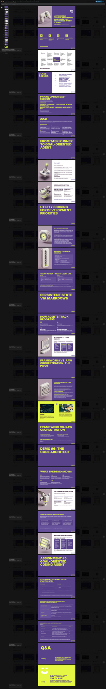

# Class 07 — Autonomous Agency: Engineering Goal-Oriented Reasoning & Intent (+ Demo)

**Course:** Multi-Agent AI for Game Development (ELVTR) · **Instructor:** Joshua Burdick
**Source:** slide-panel screenshot of the deck, captured 31 Jul 2026

> ## ⚠️ PARTIAL CAPTURE — structure is real, body text is not yet transcribed
> This file was built from a **single filmstrip screenshot at 310×1998 px** covering ~31
> slides (≈60 px per slide). At that resolution **slide titles and the large callouts are
> legible; body text is not.** Everything below is either read directly off the image or
> explicitly marked as missing.
>
> **Nothing here is inferred from the other class decks or invented to fill space** — the
> gaps are left as gaps on purpose, because a plausible-sounding transcription of a slide
> nobody could read is worse than an obvious hole.
>
> **To complete it:** export the deck (File → Download → Web Page `.html` zipped, or PDF)
> and I will fill every `_(body text not legible)_` marker with the real content.

---

## Deck outline (slide order as captured)

| # | Slide | Content captured |
|---|---|---|
| 1 | **Title** — 07 · Autonomous Agency: Engineering Goal-Oriented Reasoning & Intent + Demo | ✅ complete |
| 2 | Housekeeping | ✅ (standard boilerplate across all decks) |
| 3 | Syllabus overview | ✅ (standard 14-class grid) |
| 4 | **Class agenda** | ⚠️ partial — see below |
| 5 | **Picking up from last session** | ✅ headline legible |
| 6 | Goal | ❌ title only |
| 7 | **From task runner to goal-oriented agent** | ❌ title only |
| 8 | The Shift | ❌ title only |
| 9 | Coverage Perception | ❌ title only |
| 10 | **Utility scoring for development priorities** | ❌ title only |
| 11 | The Priority Problem | ❌ title only |
| 12 | Example — Dungeon Crawler | ❌ title only |
| 13 | Taking action — what it looks like | ❌ title only |
| 14 | **Persistent state via Markdown** | ❌ title only |
| 15 | How agents track progress | ❌ title only |
| 16 | Markdown as agent memory | ❌ title only |
| 17 | **Frameworks vs. raw orchestration: the pivot** | ❌ title only |
| 18 | The centerpiece of this session | ❌ title only |
| 19 | CrewAI ｜ Raw orchestration (two-column compare) | ❌ title only |
| 20 | Framework vs. raw orchestration | ❌ title only |
| 21 | **Demo #6: The Code Architect** | ❌ title only |
| 22 | What the demo shows | ❌ title only |
| 23 | The Code Architect in action | ❌ title only |
| 24 | **The blackboard is not optional** | ❌ title only |
| 25 | Exposing agent reasoning | ❌ title only |
| 26 | **Assignment #5: Goal-Oriented Coding Agent** | ❌ title only |
| 27 | Assignment #5 — what you're starting with | ❌ title only |
| 28–29 | Assignment #5 — rubric / criteria tables | ❌ tables not legible |
| 30 | Q&A | ✅ |
| 31 | Did you enjoy the class? | ✅ |

---

## What is legible, verbatim

### Class agenda (slide 4)
Partially readable. Items that resolve:

- Goal-directed planning
- Utility scoring
- Coverage perception
- Persistent state & progress scoring
- Frameworks vs. raw orchestration
- Demo #6
- Assignment #5: goal-oriented coding agent

_(Exact wording and ordering unconfirmed — the agenda panel is at the resolution limit.)_

### Picking up from last session (slide 5)

> **"What if the agent could look at your codebase, figure out what's missing, and write it?"**

This is the session's framing question and the clearest single line in the deck.

### Section headers (the deck's spine)

1. **From task runner to goal-oriented agent** — the conceptual shift
2. **Utility scoring for development priorities** — how the agent chooses what to do next
3. **Persistent state via Markdown** — how the agent remembers across runs
4. **Frameworks vs. raw orchestration** — explicitly labelled *"the pivot"* and *"the centerpiece of this session"*
5. **Demo #6: The Code Architect** — the worked example
6. **Assignment #5: Goal-Oriented Coding Agent**

---

## Missing and needed

- [ ] Body text for slides 6–29
- [ ] **Assignment #5 due date** — not legible; likely "before S08"
- [ ] Assignment #5 deliverables and rubric (slides 27–29)
- [ ] The CrewAI vs. raw-orchestration comparison table (slide 19)
- [ ] Whatever "The blackboard is not optional" actually asserts (slide 24)
